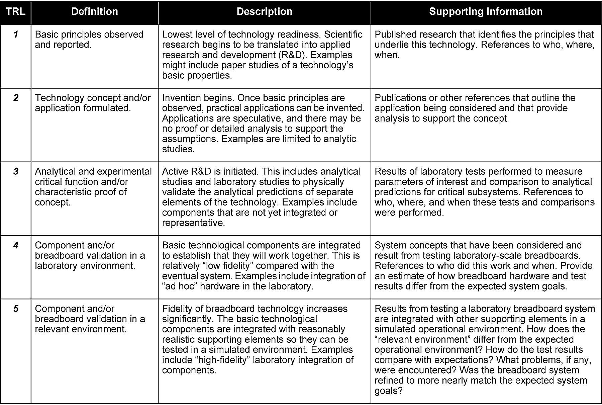
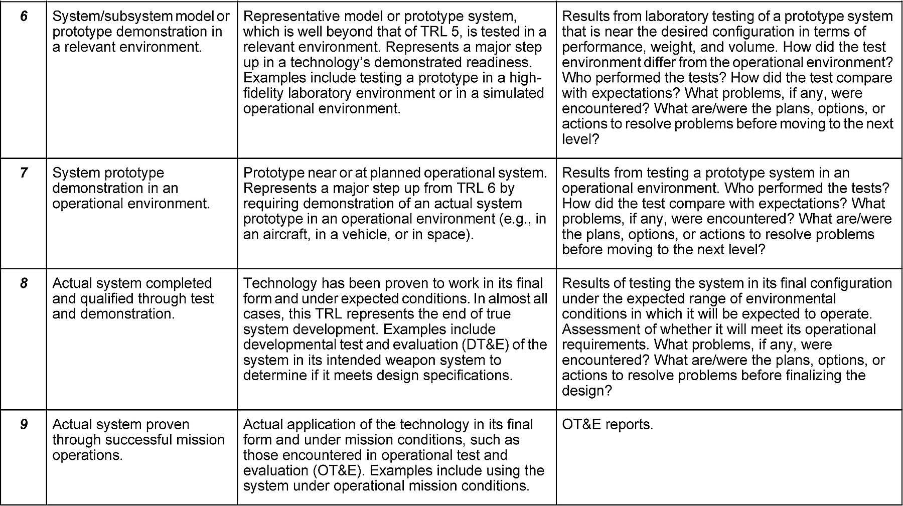
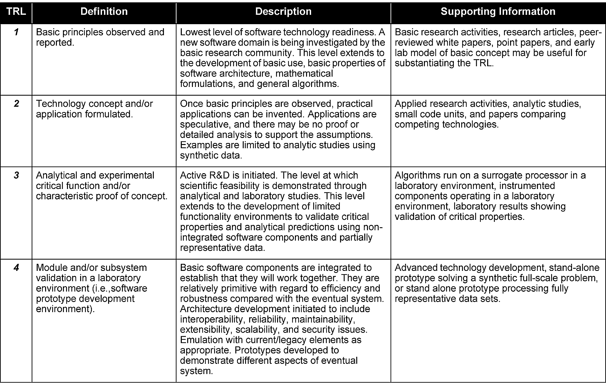
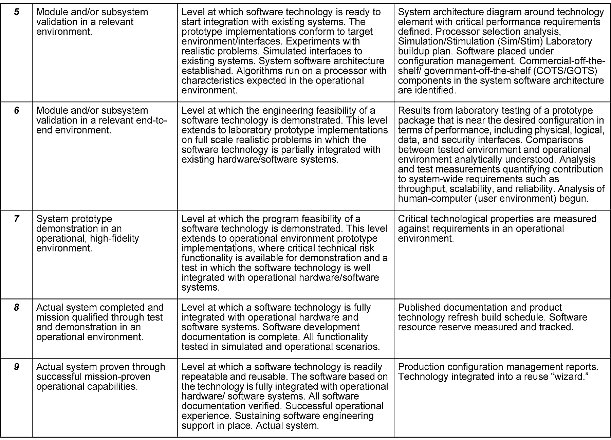
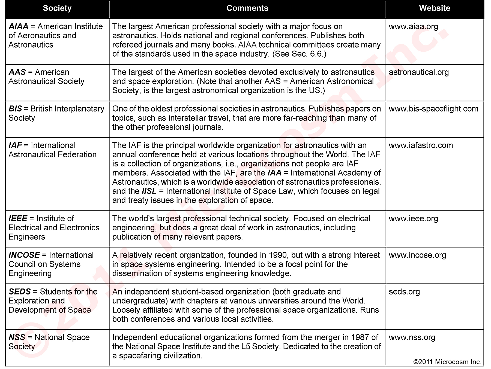
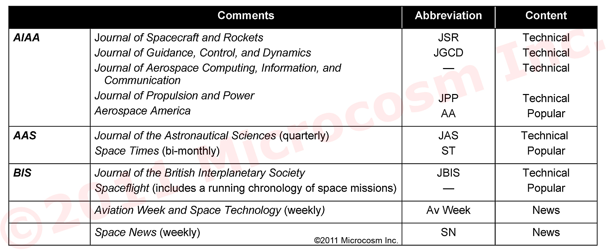
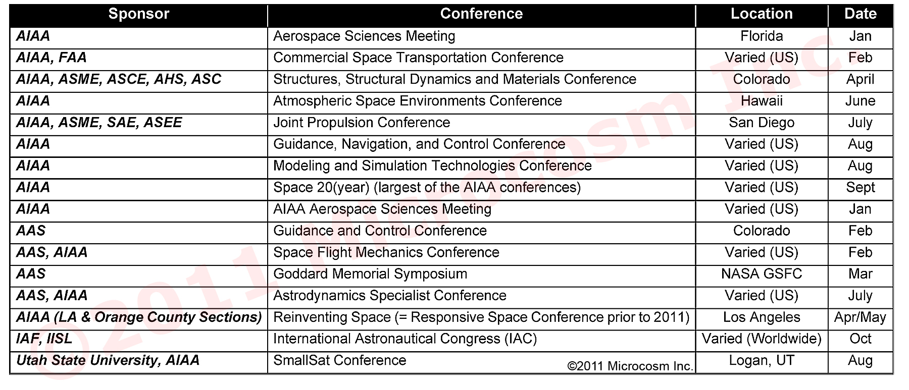

# Space Mission Analysis

# SPCE 5045

University of Colorado \- Colorado Springs

# OVERVIEW (cont.)

* Term Project Guidelines:
  * Topic is your choice based on analytical tools developed in the class
  * Topic to be approved by instructor by week 10
  * Detailed scientific/engineering analysis of topic is required
  * Paper to be ~ 15 pages in professional format
  * Project is due by the time of final exam

University of Colorado \- Colorado Springs

# Space Mission Analysis

Chapter 1 of the text is at a very\, very high level for this class\.  However\, it sets the stage for much more detailed design discussions to follow\.

Be familiar with the TRL discussions for both hardware and software development as shown in Table 1\-1

NOTE: On the inside cover of the text is a website address and password to interactive tables\, figures\, etc\. If you see a notation such as          or        attached to the tables and figures I have included in the weekly material that is the indication that you should refer to the interactive material in the text by following the instructions on the text cover\.

University of Colorado \- Colorado Springs

# Table 1-1.  Technology Readiness Levels (TRLs) for DoD Hardware Development. [DoD, 2009]

University of Colorado \- Colorado Springs

# Table 1-1. (Continued)

University of Colorado \- Colorado Springs

# Table 1-2.  Technology Readiness Levels (TRLs) for DoD Software Development. [DoD, 2009]

University of Colorado \- Colorado Springs

# Table 1-2. (Continued)

University of Colorado \- Colorado Springs

# Reference Material

The following slide indicates some of the pertinent professional organizations dealing with space missions and design

If you are not familiar with some of these organizations\, I suggest you visit their web sites to learn more about them

University of Colorado \- Colorado Springs

# Table 1-4.  Major Astronautics Professional Societies

University of Colorado \- Colorado Springs

# Table 1-5.  Major Professional Journals in Astronautics.

University of Colorado \- Colorado Springs

# Table 1-6.   Representative Regularly Held Conferences in Astronautics

University of Colorado \- Colorado Springs

