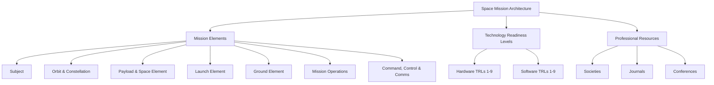

# SPCE 5045 - Space Mission Analysis: Week 1 Mastery Guide

## Overview

**Session 1: Introduction and Definition of Terms** covers the foundational vocabulary, architecture, and maturity frameworks used across all space missions. This material corresponds to Part 1, Chapters 1-3 of *Space Mission Engineering: The New SMAD* (Wertz, ISBN 978-1-881883-15-9).

Before you can design a spacecraft, select an orbit, or plan a launch, you must understand the building blocks that every space mission shares and the language professionals use to describe them. This week establishes that shared framework.

### Topic Dependency Map

---

## Topic 1: Space Mission Architecture

### Analogy

Think of a space mission like a large-scale delivery service. You have:
- **The package** (the payload/instrument that does the actual work)
- **The delivery truck** (the spacecraft bus that carries and supports the payload)
- **The road network** (the orbit the spacecraft follows)
- **The dispatch center** (the ground element that tracks and commands everything)
- **The loading dock** (the launch vehicle that gets the truck onto the road)
- **The radio system** (the command, control, and communications architecture that ties it all together)
- **The customer** (the subject being observed or served)
- **The operations manual** (mission operations -- the people and procedures running the show)

No delivery service works without all of these pieces coordinated. Similarly, a space mission is not just a satellite -- it is an *architecture* of interdependent elements.

### Core Explanation

A **space mission** is not simply a satellite in orbit. It is a complete system-of-systems designed to accomplish a specific objective. The textbook (Figure 1-3) identifies a central **Mission Concept** surrounded by interconnected elements. Every space mission -- whether it is a weather satellite, a GPS constellation, or a Mars rover -- includes these same basic building blocks, though they vary enormously in complexity.

The key insight is that these elements are not designed in isolation. Changing one element (say, the orbit altitude) ripples through every other element (ground station visibility, launch vehicle requirements, payload resolution, power needs, thermal environment, etc.). This interconnectedness is why **systems engineering** is central to space mission design.

### Formal Definitions

| Element | Definition |
|---------|-----------|
| **Mission Concept** | The overarching approach for how the mission will accomplish its objectives. It defines how information or services flow from the space system to the end user. |
| **Subject** | The thing being observed, communicated with, or acted upon (e.g., forest fires, ocean temperatures, military targets, cell phone users). |
| **Orbit and Constellation** | The path(s) in space that the spacecraft follows. A single satellite has an orbit; multiple coordinated satellites form a constellation. |
| **Payload** | The instrument(s) or equipment that directly perform the mission objective (e.g., an infrared sensor, a communications transponder, a scientific instrument). |
| **Spacecraft Bus** | The platform that supports the payload -- provides power, thermal control, attitude control, propulsion, structure, and data handling. |
| **Space Element** | The combination of payload + spacecraft bus (i.e., the complete satellite or space vehicle). |
| **Launch Element** | The rocket and associated infrastructure that places the space element into its intended orbit. |
| **Ground Element** | The facilities, hardware, and networks on Earth used to track, command, and receive data from the spacecraft. |
| **Mission Operations** | The people, procedures, and software that plan and execute the mission on a day-to-day basis. |
| **Command, Control, and Communications (C3) Architecture** | The end-to-end system for sending commands to the spacecraft and receiving data back, including relay satellites, ground stations, and data networks. |

### Worked Examples

#### Example 1: FireSat (Simple Mission)

FireSat is the textbook's running example -- a satellite system to detect forest fires using infrared (IR) sensors.

- **Subject:** Forest fires (heat signatures)
- **Payload:** Infrared sensor
- **Spacecraft Bus:** Small, 3-axis stabilized
- **Orbit:** Low Earth Orbit (LEO), ~700 km altitude, polar inclination
- **Launch Element:** Pegasus or Minotaur (small launch vehicles)
- **Ground Element:** Single dedicated ground station in CONUS (Continental United States)
- **C3 Architecture:** TDRS (Tracking and Data Relay Satellite) data downlink; commercial links to users
- **Mission Operations:** Single facility for fire detection analysis and commanding
- **Mission Concept:** IR detection of fires with results mapped and transmitted to forest rangers

#### Example 2: GPS (Complex Constellation)

- **Subject:** GPS receivers on Earth (military, civilian)
- **Payload:** Atomic clocks and L-band transmitters
- **Spacecraft Bus:** Large, 3-axis stabilized with radiation-hardened electronics
- **Orbit:** Medium Earth Orbit (MEO), ~20,200 km, 55-degree inclination, 6 orbital planes with 4+ satellites each (24-32 total)
- **Launch Element:** Atlas V, Delta IV, or Falcon 9
- **Ground Element:** Master Control Station (Schriever AFB, CO) + global monitor stations
- **C3 Architecture:** Dedicated ground-to-satellite uplinks; satellite-to-user broadcast downlinks
- **Mission Operations:** 24/7 operations center with large staff
- **Mission Concept:** Provide precise position, navigation, and timing (PNT) to unlimited users worldwide

#### Example 3: Identify the Elements (Exercise)

Consider the Hubble Space Telescope. Try to identify each element before reading the answers:

Click to reveal answers

- **Subject:** Distant galaxies, stars, nebulae (astronomical objects)
- **Payload:** Optical/UV/IR telescope with multiple instruments (cameras, spectrographs)
- **Spacecraft Bus:** Large, 3-axis stabilized, solar-powered, in LEO
- **Orbit:** LEO, ~540 km altitude, 28.5-degree inclination
- **Launch Element:** Space Shuttle Discovery (STS-31, April 1990)
- **Ground Element:** Space Telescope Science Institute (STScI) in Baltimore, MD + NASA GSFC
- **C3 Architecture:** TDRS relay for data downlink and commanding
- **Mission Operations:** STScI manages science operations; GSFC manages spacecraft health
- **Mission Concept:** Provide high-resolution astronomical observations above Earth's atmosphere

### Practice Questions

**Q1.** What is the difference between the "payload" and the "spacecraft bus"?

Answer

The **payload** is the instrument or equipment that directly accomplishes the mission objective (e.g., an IR sensor for fire detection, a camera for Earth observation). The **spacecraft bus** is everything else that supports the payload: power generation/storage, thermal control, attitude determination and control, propulsion, structure, and command/data handling. Think of the bus as the "utility vehicle" and the payload as the "cargo."

**Q2.** Why is the mission concept placed at the center of the architecture diagram (Figure 1-3)?

Answer

Because the mission concept is the unifying idea that drives all other design decisions. It defines *how* the mission will work -- how information or services flow from the space segment to the end user. Every other element (orbit, payload, bus, launch, ground, operations, C3) is designed to support the mission concept. Change the concept, and every element may need to change.

**Q3.** A communications satellite in geostationary orbit serves cell phone users. Identify the "subject" of this mission.

Answer

The **subject** is the cell phone users (or more precisely, the handheld receivers). The subject is what the mission is serving or observing. In a communications mission, the subject is the end user being served.

**Q4.** Explain why changing the orbit altitude of a satellite affects the launch element, the payload, and the ground element.

Answer

- **Launch element:** Higher orbits require more energy (delta-v), demanding a larger or more capable launch vehicle.
- **Payload:** Higher altitude means the satellite is farther from the subject. For observation missions, this degrades resolution unless the aperture is increased. For communications, signal strength decreases with distance (inverse-square law).
- **Ground element:** Higher orbits change the visibility windows -- geostationary orbits provide continuous coverage from one ground station, while LEO requires multiple stations or relay satellites for continuous contact.

### Common Pitfalls

1. **Confusing "payload" with "satellite."** The payload is only the mission-specific instrument. The satellite includes both the payload and the spacecraft bus.

2. **Thinking of a space mission as just the satellite.** The satellite is only the space element. A complete mission includes ground, launch, operations, and communications elements too.

3. **Forgetting the subject.** Students often focus on the spacecraft and forget to clearly define *what* is being observed or served. The subject drives the entire mission design.

4. **Assuming elements are independent.** Every element interacts with every other element. Orbit selection affects payload design, power requirements, thermal environment, communications architecture, launch vehicle selection, and ground station placement.

### Key Takeaways

- A space mission is a **system-of-systems** with interdependent elements, not just a satellite.
- The **Mission Concept** is the central organizing idea; all elements serve it.
- There are **8 key elements**: Subject, Orbit/Constellation, Payload, Spacecraft Bus (together forming the Space Element), Launch Element, Ground Element, Mission Operations, and C3 Architecture.
- **Systems engineering** is essential because changing one element creates ripple effects across all others.
- The FireSat example will be used throughout the course as a reference mission.

> **Active Recall:** Close this guide and sketch the mission architecture diagram from memory, labeling all 8 elements. Can you do it without looking?

---

## Topic 2: Technology Readiness Levels (TRLs)

### Analogy

Imagine you are developing a new recipe for a restaurant:

| TRL Equivalent | Cooking Analogy |
|---|---|
| TRL 1 | You read about a new ingredient in a food science journal |
| TRL 2 | You brainstorm a recipe idea that might use this ingredient |
| TRL 3 | You test the ingredient in small lab-style taste tests |
| TRL 4 | You cook a rough prototype dish in your home kitchen |
| TRL 5 | You refine the dish and test it in a kitchen similar to the restaurant's |
| TRL 6 | You prepare a near-final version in the actual restaurant kitchen |
| TRL 7 | You serve it to a test group of diners in the restaurant |
| TRL 8 | The dish is on the menu, fully tested under normal service conditions |
| TRL 9 | The dish has been served successfully night after night with consistent results |

Each level represents increasing confidence that the technology (or dish) will work in its intended environment.

### Core Explanation

**Technology Readiness Levels (TRLs)** are a systematic framework, originally developed by NASA and adopted by the Department of Defense (DoD), for evaluating how mature a technology is. The scale runs from **TRL 1** (basic scientific principles observed) to **TRL 9** (actual system proven through successful mission operations).

TRLs matter because space missions are expensive and cannot be easily repaired once launched. Using immature technology (low TRL) on a flight mission dramatically increases risk. Program managers use TRLs to:

- Assess whether a technology is ready for a particular program phase
- Identify what additional development, testing, or demonstration is needed
- Communicate technology maturity across organizations in a standardized way
- Make informed decisions about risk vs. schedule vs. cost

The DoD defines separate TRL scales for **hardware** and **software** because the nature of maturation differs (hardware requires physical testing in increasingly realistic environments; software requires integration with increasingly complete systems).

### Formal Definitions

#### Hardware TRLs (Table 1-1)

| TRL | Definition | Description | Supporting Information |
|-----|-----------|-------------|----------------------|
| **1** | Basic principles observed and reported | Lowest level. Scientific research translated into applied R&D. Paper studies of basic properties. | Published research identifying principles. References to who, where, when. |
| **2** | Technology concept and/or application formulated | Invention begins. Practical applications speculated. No proof or detailed analysis. Limited to analytic studies. | Publications outlining the application and providing analysis to support the concept. |
| **3** | Analytical and experimental critical function and/or characteristic proof of concept | Active R&D initiated. Analytical and lab studies validate predictions of separate technology elements. Not yet integrated or representative. | Lab test results measuring parameters of interest, compared to analytical predictions. |
| **4** | Component and/or breadboard validation in a laboratory environment | Basic components integrated to show they work together. "Low fidelity" compared to eventual system. "Ad hoc" hardware in the lab. | System concepts considered. Results from testing lab-scale breadboards. |
| **5** | Component and/or breadboard validation in a relevant environment | Fidelity increases significantly. Components integrated with realistic supporting elements. Tested in simulated operational environment. "High-fidelity" lab integration. | Results from testing a lab breadboard system integrated with supporting elements in a simulated environment. |
| **6** | System/subsystem model or prototype demonstration in a relevant environment | Representative model or prototype tested well beyond TRL 5, in a relevant environment. Major step up in demonstrated readiness. Prototype tested in high-fidelity lab or simulated operational environment. | Lab testing of a prototype near desired configuration in terms of performance, weight, and volume. |
| **7** | System prototype demonstration in an operational environment | Prototype near or at planned operational system. Major step from TRL 6. Demonstration in actual operational environment (aircraft, vehicle, or space). | Results from testing a prototype in an operational environment. |
| **8** | Actual system completed and qualified through test and demonstration | Technology proven in final form under expected conditions. End of true system development. Includes DT&E (Developmental Test & Evaluation). | Results of testing in final configuration under expected range of environmental conditions. |
| **9** | Actual system proven through successful mission operations | Actual application in final form under mission conditions. Includes OT&E (Operational Test & Evaluation). | OT&E reports. |

#### Software TRLs (Table 1-2)

| TRL | Definition | Description | Supporting Information |
|-----|-----------|-------------|----------------------|
| **1** | Basic principles observed and reported | New software domain investigated. Basic use, architecture, math formulations, and algorithms developed. | Research articles, white papers, early lab models. |
| **2** | Technology concept and/or application formulated | Practical applications speculated. Limited to analytic studies using synthetic data. | Applied research, small code units, papers comparing technologies. |
| **3** | Analytical and experimental critical function and/or characteristic proof of concept | Scientific feasibility demonstrated through analytical and lab studies. Limited functionality environments. Non-integrated components with partially representative data. | Algorithms run on surrogate processor in lab, instrumented components in lab, validation of critical properties. |
| **4** | Module and/or subsystem validation in a laboratory environment | Basic software components integrated. Relatively primitive. Architecture development initiated (interoperability, reliability, maintainability, extensibility, scalability, security). Prototypes demonstrate different aspects. | Advanced development, stand-alone prototype solving a synthetic full-scale problem. |
| **5** | Module and/or subsystem validation in a relevant environment | Ready for integration with existing systems. Implementations conform to target environment/interfaces. Experiments with realistic problems. Simulated interfaces. System software architecture established. Algorithms run on processor with characteristics expected in operational environment. COTS/GOTS components identified. | Architecture diagram, critical performance requirements defined, processor selection analysis, Sim/Stim lab buildup plan, software under configuration management. |
| **6** | Module and/or subsystem validation in a relevant end-to-end environment | Engineering feasibility demonstrated. Lab prototype implementations on full-scale realistic problems. Software partially integrated with existing hardware/software. | Lab testing of prototype package near desired configuration (physical, logical, data, security interfaces). |
| **7** | System prototype demonstration in an operational, high-fidelity environment | Program feasibility demonstrated. Operational environment prototype. Critical technical risk functionality available for demonstration. Well integrated with operational hardware/software. | Critical properties measured against requirements in an operational environment. |
| **8** | Actual system completed and mission qualified through test and demonstration | Software fully integrated with operational hardware and software. All functionality tested in simulated and operational scenarios. | Published documentation, technology refresh build schedule, resource reserve measured and tracked. |
| **9** | Actual system proven through successful mission-proven operational capabilities | Software readily repeatable and reusable. Fully integrated with operational systems. All documentation verified. Successful operational experience. Sustaining software engineering in place. | Production configuration management reports. Technology integrated into a reuse "wizard." |

### Worked Examples

#### Example 1: Classifying a New Solar Panel Technology

A research team publishes a paper showing that a new perovskite-silicon tandem solar cell achieves 33% efficiency in the lab.

- **Current TRL:** TRL 3 -- They have lab results validating analytical predictions for a key parameter (efficiency), but the cells are not yet integrated into a breadboard power system.
- **Next step to TRL 4:** Integrate the cells into a small prototype solar panel assembly and demonstrate power output in a laboratory setting.
- **Next step to TRL 5:** Test the prototype panel under simulated space conditions (vacuum, temperature cycling, UV exposure).

#### Example 2: Software for Autonomous Fire Detection

An algorithm is written to automatically detect fires from IR satellite imagery. It has been tested on synthetic (simulated) IR data and shows promising detection rates.

- **Current TRL:** TRL 2 -- Applications are speculative, studies use synthetic data, no proof in a real environment.
- **Next step to TRL 3:** Run the algorithm on a surrogate processor using partially representative data (e.g., actual IR images from existing satellites), validate detection performance.

#### Example 3: Assigning TRL to a Known System

The GPS Block IIF satellites have been operating successfully since 2010, providing position, navigation, and timing services.

- **TRL:** TRL 9 -- The actual system is proven through successful mission operations over many years.

### Practice Questions

**Q1.** A startup company has built a prototype communications antenna using a new metamaterial. They have tested it in an anechoic chamber (a specialized lab that simulates free-space electromagnetic conditions). What TRL is this?

Answer

**TRL 5.** The antenna is a breadboard/prototype that has been tested in a relevant (simulated) environment. An anechoic chamber simulates the electromagnetic environment but is not the actual operational environment (space).

**Q2.** Why does the DoD maintain separate TRL scales for hardware and software?

Answer

Hardware and software mature differently. Hardware maturation involves physical fabrication, environmental testing, and demonstration in increasingly realistic physical environments. Software maturation involves integration with increasingly complete systems, validation against realistic data, and demonstration of reliability/scalability/security in operational computing environments. The milestones and evidence required at each level differ fundamentally.

**Q3.** A program manager wants to include a TRL 4 component in a spacecraft scheduled for launch in 2 years. What are the risks?

Answer

TRL 4 means only lab-level breadboard validation. To reach TRL 8 (flight-qualified) requires advancing through 4 more levels -- prototype testing in relevant environment (TRL 5), prototype in simulated operational environment (TRL 6), prototype in actual operational environment (TRL 7), and full qualification testing (TRL 8). Each step requires time, money, and may reveal problems. The risk is that the technology may not mature fast enough, causing schedule delays or requiring a fallback to a higher-TRL alternative. This is a significant programmatic risk.

**Q4.** What is the key difference between TRL 6 and TRL 7?

Answer

**TRL 6** tests a prototype in a **relevant** environment (high-fidelity laboratory or simulated operational conditions). **TRL 7** tests a prototype in an **actual operational** environment (e.g., on an aircraft, in a vehicle, or in space). The jump from simulated to real operational environment is a major step in demonstrated readiness.

### Common Pitfalls

1. **Confusing TRL with quality or reliability.** A TRL 9 system can still fail. TRL measures maturity of the technology, not the reliability of a specific unit.

2. **Skipping TRL levels.** Each level builds evidence that reduces risk. Skipping levels (e.g., going from TRL 3 directly to TRL 7) dramatically increases the chance of discovering problems too late.

3. **Assigning TRL to the wrong level of abstraction.** A subsystem may be TRL 7 while a component within it is TRL 4. The system TRL is limited by its least mature critical component.

4. **Confusing "tested in a relevant environment" with "tested in the operational environment."** TRL 5-6 use simulated or lab-representative conditions. TRL 7 requires the actual operational environment. This distinction matters enormously for space systems where the operational environment (vacuum, radiation, microgravity) cannot be perfectly simulated on the ground.

### Key Takeaways

- TRLs provide a **standardized language** for communicating technology maturity across organizations.
- The scale runs **1 (basic research) to 9 (proven in operations)**, with each level requiring specific evidence.
- **Hardware and software** have separate but parallel TRL definitions.
- Low-TRL technologies carry **higher programmatic risk** (cost, schedule, technical).
- The TRL of a system is bounded by its **least mature critical component**.

> **Active Recall:** Without looking, list the 9 TRL levels for hardware by their one-line definitions. Can you remember the key distinction between TRL 5 and TRL 6? Between TRL 7 and TRL 8?

---

## Topic 3: Space Industry Professional Resources

### Analogy

Just as medical professionals have the AMA (American Medical Association) and lawyers have the ABA (American Bar Association), space professionals have their own ecosystem of societies, journals, and conferences. Knowing where to find information and who the key players are is essential for any engineer entering the field.

### Core Explanation

The space industry is supported by professional organizations that publish research, set standards, hold conferences, and connect practitioners. These resources are where you will find the latest research, established best practices, and networking opportunities throughout your career.

### Formal Definitions

#### Major Professional Societies (Table 1-4)

| Acronym | Full Name | Focus |
|---------|-----------|-------|
| **AIAA** | American Institute of Aeronautics and Astronautics | Largest American professional society with a major focus on astronautics. Publishes refereed journals and many books. Creates many industry standards. |
| **AAS** | American Astronautical Society | Largest American society devoted exclusively to astronautics and space exploration. (Note: Not to be confused with the American Astronomical Society, which shares the same acronym.) |
| **BIS** | British Interplanetary Society | One of the oldest professional societies in astronautics. Publishes papers on far-reaching topics like interstellar travel. |
| **IAF** | International Astronautical Federation | Principal worldwide organization for astronautics. Holds annual International Astronautical Congress (IAC). A collection of organizations (not individuals). Associated with the IAA (International Academy of Astronautics) and IISL (International Institute of Space Law). |
| **IEEE** | Institute of Electrical and Electronics Engineers | World's largest professional technical society. Focused on electrical engineering but publishes significant astronautics-related work. |
| **INCOSE** | International Council on Systems Engineering | Founded in 1990. Focal point for dissemination of systems engineering knowledge. Particularly relevant to space mission design. |
| **SEDS** | Students for the Exploration and Development of Space | Independent student organization (graduate and undergraduate) at universities worldwide. |
| **NSS** | National Space Society | Independent educational organization formed in 1987 from the merger of the National Space Institute and the L5 Society. Dedicated to creating a spacefaring civilization. |

#### Major Professional Journals (Table 1-5)

| Publisher | Journal | Abbreviation | Content Type |
|-----------|---------|-------------|-------------|
| AIAA | *Journal of Spacecraft and Rockets* | JSR | Technical |
| AIAA | *Journal of Guidance, Control, and Dynamics* | JGCD | Technical |
| AIAA | *Journal of Aerospace Computing, Information, and Communication* | -- | Technical |
| AIAA | *Journal of Propulsion and Power* | JPP | Technical |
| AIAA | *Aerospace America* | AA | Popular |
| AAS | *Journal of the Astronautical Sciences* | JAS | Technical (quarterly) |
| AAS | *Space Times* | ST | Popular (bi-monthly) |
| BIS | *Journal of the British Interplanetary Society* | JBIS | Technical |
| BIS | *Spaceflight* | -- | Popular (running chronology of space missions) |
| -- | *Aviation Week and Space Technology* | Av Week | News (weekly) |
| -- | *Space News* | SN | News (weekly) |

#### Representative Conferences (Table 1-6)

| Sponsor | Conference | Location | Typical Month |
|---------|-----------|----------|--------------|
| AIAA | Aerospace Sciences Meeting | Florida | January |
| AIAA, FAA | Commercial Space Transportation Conference | Varied (US) | February |
| AIAA, ASME, ASCE, AHS, ASC | Structures, Structural Dynamics and Materials Conference | Colorado | April |
| AIAA | Atmospheric Space Environments Conference | Hawaii | June |
| AIAA, ASME, SAE, ASEE | Joint Propulsion Conference | San Diego | July |
| AIAA | Guidance, Navigation, and Control Conference | Varied (US) | August |
| AIAA | Space 20(year) (largest AIAA conference) | Varied (US) | September |
| AAS | Guidance and Control Conference | Colorado | February |
| AAS, AIAA | Space Flight Mechanics Conference | Varied (US) | February |
| AAS | Goddard Memorial Symposium | NASA GSFC | March |
| AAS, AIAA | Astrodynamics Specialist Conference | Varied (US) | July |
| IAF, IISL | International Astronautical Congress (IAC) | Varied (Worldwide) | October |
| Utah State University, AIAA | SmallSat Conference | Logan, UT | August |

### Practice Questions

**Q1.** You need to find a peer-reviewed paper on a new propulsion technology. Which journals would be most relevant?

Answer

The AIAA *Journal of Propulsion and Power* (JPP) is the most directly relevant. You might also check the AIAA *Journal of Spacecraft and Rockets* (JSR) or the AAS *Journal of the Astronautical Sciences* (JAS).

**Q2.** What is the difference between AIAA and AAS?

Answer

**AIAA** covers all of aeronautics and astronautics (aircraft + spacecraft) and is the larger organization. **AAS** is devoted exclusively to astronautics and space exploration. Both publish technical journals and hold conferences, sometimes jointly.

**Q3.** What does INCOSE stand for and why is it relevant to this course?

Answer

**INCOSE** = International Council on Systems Engineering. It is relevant because space mission design is fundamentally a systems engineering discipline -- integrating multiple subsystems (payload, bus, ground, launch, operations) to meet mission objectives. INCOSE provides the knowledge base, standards, and community for systems engineering practice.

### Common Pitfalls

1. **Confusing AAS (American Astronautical Society) with AAS (American Astronomical Society).** Both use the same abbreviation. The Astronautical Society focuses on space engineering and exploration; the Astronomical Society focuses on the science of celestial objects.

2. **Ignoring professional resources.** These societies, journals, and conferences are where current best practices are published and where standards originate. Using outdated or non-peer-reviewed information can lead to poor design decisions.

### Key Takeaways

- The space industry has a well-established ecosystem of **professional societies** (AIAA, AAS, IAF, IEEE, INCOSE, etc.).
- **Peer-reviewed journals** (JSR, JGCD, JPP, JAS, JBIS) are the authoritative source for technical knowledge.
- **Conferences** are where new work is presented and professional relationships are built.
- Familiarity with these resources is expected of working professionals in the field.

---

## Integrative Summary

Week 1 establishes three foundational layers:

1. **Architecture** -- Every space mission is a system-of-systems built from the same set of interdependent elements (subject, orbit, payload, bus, launch, ground, operations, C3). You cannot design any one element without considering all the others.

2. **Maturity** -- Technology Readiness Levels provide a standardized 1-9 scale for assessing how ready a technology is for operational use. Lower TRL means higher risk. Both hardware and software have their own TRL definitions.

3. **Resources** -- The professional societies, journals, and conferences form the knowledge infrastructure of the space industry. Knowing where to find authoritative information is a core professional skill.

These three layers provide the vocabulary and mental models needed for every subsequent topic in the course. When we discuss orbit design, payload selection, or mission operations in later weeks, we will always be working within the mission architecture framework, assessing technology maturity, and referencing the professional literature.

> **Spaced Review Prompt:** After 24 hours, try to:
> 1. Draw the mission architecture diagram from memory (all 8 elements)
> 2. List the 9 hardware TRL levels from memory
> 3. Name at least 4 professional societies and their acronyms

---

## Glossary

| Term | Definition |
|------|-----------|
| **AAS** | American Astronautical Society. Largest American society devoted exclusively to astronautics. |
| **AIAA** | American Institute of Aeronautics and Astronautics. Largest American professional society for aeronautics and astronautics. |
| **BIS** | British Interplanetary Society. One of the oldest professional societies in astronautics. |
| **C3** | Command, Control, and Communications. The architecture for sending commands to and receiving data from spacecraft. |
| **CONUS** | Continental United States. |
| **COTS** | Commercial Off-The-Shelf. Pre-existing commercially available components. |
| **DT&E** | Developmental Test and Evaluation. Testing during development to verify design meets specifications. |
| **GOTS** | Government Off-The-Shelf. Pre-existing government-developed components. |
| **GEO** | Geostationary Earth Orbit. Circular orbit at ~35,786 km altitude above the equator with a period of 24 hours. |
| **GPS** | Global Positioning System. US satellite navigation constellation providing position, navigation, and timing services. |
| **IAA** | International Academy of Astronautics. Worldwide association of astronautics professionals, associated with IAF. |
| **IAC** | International Astronautical Congress. Annual worldwide astronautics conference organized by IAF. |
| **IAF** | International Astronautical Federation. Principal worldwide organization for astronautics. |
| **IEEE** | Institute of Electrical and Electronics Engineers. World's largest professional technical society. |
| **IISL** | International Institute of Space Law. Focuses on legal and treaty issues in space exploration, associated with IAF. |
| **INCOSE** | International Council on Systems Engineering. Focal point for systems engineering knowledge. |
| **IR** | Infrared. Electromagnetic radiation with wavelengths longer than visible light, used for thermal detection. |
| **LEO** | Low Earth Orbit. Generally defined as orbits with altitudes between ~200 km and ~2,000 km. |
| **MEO** | Medium Earth Orbit. Orbits between LEO and GEO, typically ~2,000 km to ~35,786 km altitude. |
| **Mission Architecture** | The complete set of interconnected elements that make up a space mission. |
| **Mission Concept** | The overarching approach for how a mission accomplishes its objectives. |
| **NSS** | National Space Society. Educational organization dedicated to creating a spacefaring civilization. |
| **OT&E** | Operational Test and Evaluation. Testing under actual mission/operational conditions. |
| **Payload** | The instrument(s) or equipment that directly perform the mission objective. |
| **R&D** | Research and Development. |
| **SEDS** | Students for the Exploration and Development of Space. Independent student-based organization. |
| **SMAD** | Space Mission Analysis and Design. Refers to the textbook series; "The New SMAD" is the current edition titled *Space Mission Engineering*. |
| **Spacecraft Bus** | The platform that supports the payload, providing power, thermal control, attitude control, propulsion, structure, and data handling. |
| **Space Element** | The combination of payload and spacecraft bus -- the complete satellite or space vehicle. |
| **Systems Engineering** | The interdisciplinary approach to designing, integrating, and managing complex systems over their life cycles. |
| **TDRS** | Tracking and Data Relay Satellite. NASA's constellation of relay satellites for communicating with LEO spacecraft. |
| **TRL** | Technology Readiness Level. A 1-9 scale measuring the maturity of a technology. |

---

## References

1. Wertz, J.R., Everett, D.F., and Puschell, J.J., *Space Mission Engineering: The New SMAD*, Microcosm Press, 2011. ISBN 978-1-881883-15-9. (Chapters 1-3)
2. Department of Defense, *Technology Readiness Assessment (TRA) Deskbook*, DoD, 2009. (Source for Tables 1-1 and 1-2)
3. NASA, *Definition of Technology Readiness Levels*, available at NASA website.
4. AIAA -- www.aiaa.org
5. AAS (American Astronautical Society) -- astronautical.org
6. BIS -- www.bis-spaceflight.com
7. IAF -- www.iafastro.com
8. IEEE -- www.ieee.org
9. INCOSE -- www.incose.org
10. SEDS -- seds.org
11. NSS -- www.nss.org
