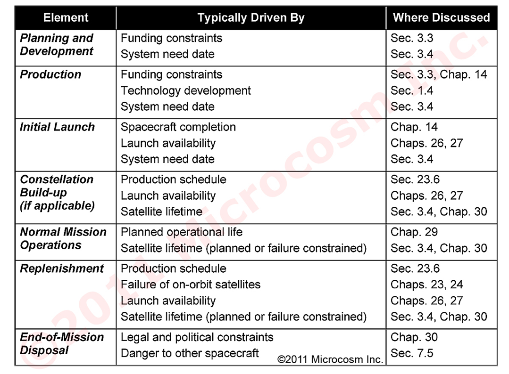
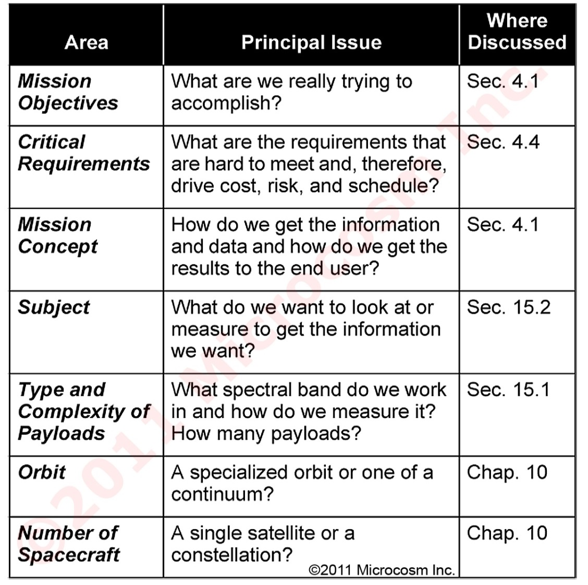
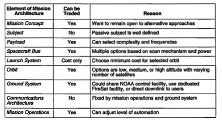
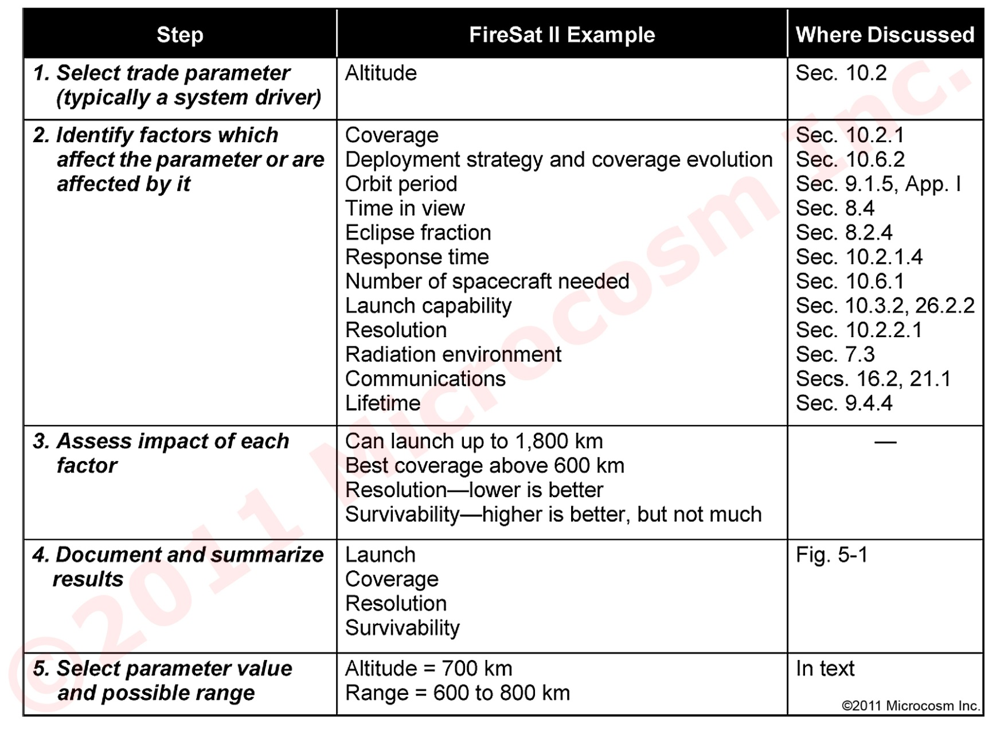
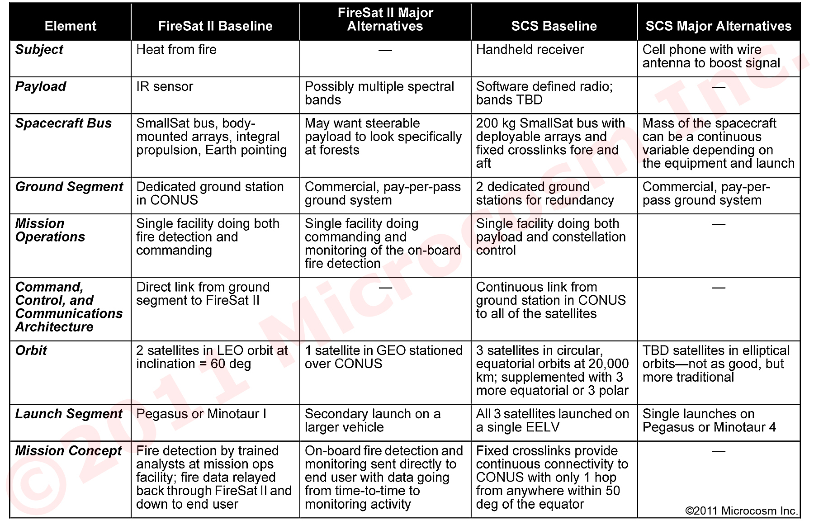
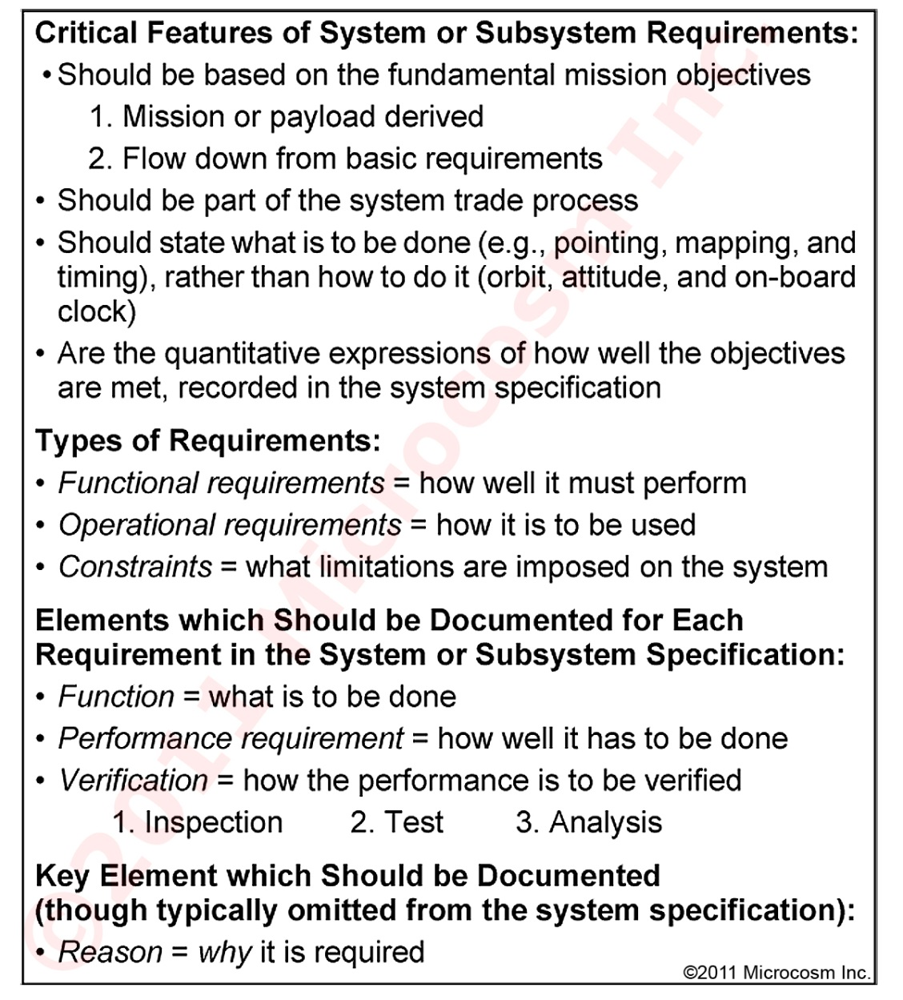
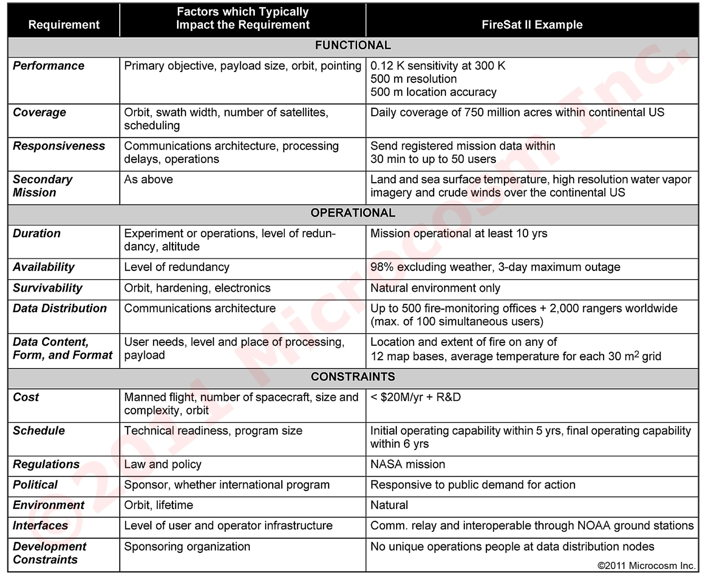

# Space Mission Analysis

# SPCE 5045

# Session 2 Topics

Space Mission Concept Definition

Mission Analysis

Trade studies

Requirements process

Specifications

Standards

# Space Mission Concept Definition

# Space Mission Architecture

# Mission Concept

# Table 4-8.   Principal Elements of the Mission Timeline

# Mission Analysis

# Common System Drivers (Table 4-16)

# Alternative Architecture Derivation

# Table 5-2.	Principal Areas for Key System Trades

\(See Table 5\-3 for examples\)

# Trade-off Possibilities

# FireSat Trades

# Table 5-4.   System Trade Process for Parameters with Multiple Effects

# Table 5-12.  Definition of the Initial Baseline and Major Alternatives for FireSat II and SCS.

# Table 6-1.  Critical Issues in Requirements Development

# Requirements Activities and Processes (1)

# Requirements Baseline

# Table 6-2.	Example of Top Level Mission Requirements

# Aspects of “Operability”

1\.    __visibility/observability__   : the extent to which the system provides the operations team with usable information about the configuration\, status\, and performance of the system\. 

2\.    __commandability/controllability__   : the extent to which the operations team can place the flight system in the desired state and produce the desired outcome via commanding\. 

3\.    __predictability__   : the extent to which the operations team is able to predict\, with some certainty\, the outcome of the execution of a planned event\. 

4\.    __flexibility__   : the extent to which the operations team can reconfigure components to maximize or optimize component utilization\, to circumvent anomalous components\, provide options\, to increase robustness\. 

5\.    __robustness__   : the extent to which the system maintains performance under perturbations and prevents and contains errors\. 

6\.    __autonomy__   : the extent to which the system manages nominal or contingency operations without ground intervention\. 

7\.   __ efficiency__   : the extent to which the operations team can optimize the use of time and resources\. 

8\.    __testability__   : the extent to which the operations team can verify and validate system components and test assets\. 

9\.   tractability  : the extent to which the operations team is freed from the need to pay attention to\, or “care and feed” the system\. 

