# SPCE 5045 Homework #1 -- Comprehensive Tutorial & Learning Guide

**Course:** SPCE 5045 Space Mission Analysis
**Topic:** Multi-Stage Rocket Sizing (Chapter 1)
**Textbook:** Wertz, J.R., Everett, D.F., and Puschell, J.J., *Space Mission Engineering: The New SMAD*, Microcosm Press, 2011. ISBN 978-1-881883-15-9.
**Reference Pages:** Chapter 1, pp. 10--11 (delta-V requirements and staging discussion)

---

## How to Use This Document

This is a **Socratic-style tutorial** — it's designed to walk you through the thought process behind solving the homework, not just hand you the answer. Each phase poses guiding questions. **Stop and try them yourself** before reading the explanation. You'll learn far more by wrestling with a concept for a few minutes than by jumping straight to the solution.

It's structured in phases that follow the natural problem-solving flow: understand the physics first, build up the math, compute the answers, then generalize.

---

## Overview

This tutorial covers multi-stage rocket sizing—a foundational topic in space mission engineering. You'll learn how to determine the number of rocket stages needed to reach orbit from different celestial bodies, compute total rocket mass using a simplified staging model, and derive a general formula that reveals the exponential nature of rocket mass growth.

---

SPCE 5045 
Homework #1
2025

50 points total

Chapter 1:

NOTE: Use the common terminology of stage number, i.e., “1st stage” is the bottom or biggest stage, 2nd stage is the next one “up”, etc.  (See discussion on pages 10 and 11 in the text for the ΔV required)
	
1. (15 points) Assume that a single rocket stage can provide a delta V of 3 km/sec. Determine how many stages would it take to get to orbit from the surface of:

a) the Moon (ΔV=1.7 km/s)
b) the Earth (ΔV=7.8 km/s)
c) Jupiter (if it had a solid surface! ΔV= 42 km/s)

2. (30 points) Assume that the mass of each rocket stage is equal to the mass of all the stages above it plus the 100 kg payload. Based on the number of stages determined in problem #1, if you wanted to put a 100 kg payload into orbit around the Moon, calculate the total mass of the rocket (all stages and the 100 kg payload) lifting off from the Moon.  Answer the same question for lifting off from the Earth and likewise for Jupiter. Round up the values you determine since stages are not fractional.

3. (5 points) Based on the above problems, what would be a simple mathematical relationship you could use for an “n” stage rocket and 100 kg payload?

---

### Topic Dependencies


### Big Picture

The central challenge of spaceflight is this: rockets must carry their own fuel, but that fuel has mass, which requires more fuel to lift, which has more mass... This creates an exponential relationship between the velocity change (delta-V) a rocket needs and its total mass. In this tutorial, we explore this relationship through a simplified staging model where each stage's mass equals everything above it plus the payload. This model, while not physically exact, captures the essential truth: **escaping deeper gravity wells costs exponentially more mass.**

By the end, you'll understand:
- Why we need multiple stages (and how many for different destinations)
- How mass compounds through a rocket stack
- The mathematical formula $M = m_p \times 2^n$ and why it works
- How this connects to the real Tsiolkovsky rocket equation

---

## Prerequisite Definitions

Before diving in, let's nail down precise definitions for every term you'll run into. Having these down cold will save you a lot of confusion later.

### Delta-V (delta-V or dV)

**Definition:** Delta-V (written as delta-V, or mathematically as $\Delta V$) is the **change in velocity** a rocket can produce, measured in km/s or m/s. It's the single most important metric for describing what a rocket can actually *do* — it captures how much "effort" the rocket can expend to change its orbit, escape a gravity well, or land on a surface.

**Physical meaning:** Picture yourself floating in deep space. You fire your engine until the tank runs dry — the total change in your speed is your delta-V. Near planets, gravity complicates things (you lose some delta-V just fighting gravity), but delta-V is still the standard currency of spaceflight.

**Textbook context:** Wertz et al., Chapter 1 (pp. 10--11) list the approximate delta-V needed to reach low orbit from the surface of various bodies. These values account for gravity losses and atmospheric drag (where applicable).

**Key values for this homework:**

| Body | delta-V to orbit (km/s) | Source |
|------|------------------------|--------|
| Moon | 1.7 | Wertz Ch. 1, p. 10 |
| Earth | 7.8 | Wertz Ch. 1, p. 10 |
| Jupiter | 42.0 | Wertz Ch. 1, p. 11 |

### Rocket Stage

**Definition:** A **stage** is a self-contained section of a rocket with its own propellant, structure, and engine(s). Once a stage burns through its propellant, it gets jettisoned — separated and discarded — which reduces the mass the remaining stages have to accelerate. That's the fundamental principle of **staging**: throw away the empty structure so you're not wasting energy hauling dead weight.

**Convention in this homework:** "1st stage" = the **bottom** (largest) stage, the one that fires first at liftoff. "2nd stage" = the next one up, and so on. The topmost stage (smallest, last to fire) carries the payload directly. This is standard industry convention — when someone says "the first stage of a Falcon 9," they mean the big booster at the bottom.

### Payload

**Definition:** The **payload** is the useful mass the rocket is designed to deliver to orbit. In our problem, that's **100 kg** — the thing you're actually trying to get into orbit. It sits on top of all the stages.

### Ceiling Function (ceil)

**Definition:** The **ceiling function**, written $\lceil x \rceil$ or `ceil(x)`, returns the smallest integer greater than or equal to $x$. In other words, it "rounds up."

**Examples:**
- ceil(1.7 / 3.0) = ceil(0.567) = 1
- ceil(7.8 / 3.0) = ceil(2.6) = 3
- ceil(42.0 / 3.0) = ceil(14.0) = 14

**Why it matters here:** You can't build 0.567 of a stage. If you need 0.567 stages' worth of delta-V, you have to build 1 complete stage. Partial stages don't exist in real rockets.

---

## Phase 1: Understanding What the Problem Asks

### Analogy

Think of delta-V like the **total distance a car can drive on a full tank of gas**. If you need to drive 300 miles and your car gets 100 miles per tank, you'll need to stop and refuel 3 times (or carry 3 tanks). But here's the twist: imagine your car gets heavier the more fuel tanks you carry, and heavier cars burn fuel faster. That's the rocket problem—except instead of getting slightly worse mileage, rockets face an exponential penalty.

The "3 km/s per stage" in our problem is like saying "each fuel tank gets you 100 miles." If your destination requires 260 miles, two tanks (200 miles) won't cut it—you need three, even though you'll have 40 miles of range left over when you arrive.

### Guiding Questions

1. **What does it mean for a single stage to "provide" 3 km/s of delta-V?** Think about what physical property of the stage (propellant fraction, exhaust velocity, etc.) determines this number. For our purposes, we're taking it as a given — each stage contributes exactly 3 km/s, regardless of size.

2. **If each stage gives 3 km/s and you need 7.8 km/s total, why can't you use 2.6 stages?** What physical constraint forces us to round up?

3. **Read the problem statement again carefully.** There are actually *three separate sub-problems*. Can you identify what each one asks before attempting any calculations?

*Pause and think about these before continuing.*

---

### Derivation and Explanation

The three sub-problems are:

**Problem 1 (15 pts):** Given delta-V per stage = 3 km/s, find the minimum number of stages for three bodies (Moon, Earth, Jupiter). This is a straightforward division-and-round-up problem.

**Problem 2 (30 pts):** Given a specific mass rule (each stage's mass = everything above it + payload), compute the total rocket mass for each body, using the stage counts from Problem 1.

**Problem 3 (5 pts):** Generalize Problem 2 into a mathematical formula for *n* stages and 100 kg payload.

They build on each other sequentially: Problem 1's output feeds into Problem 2, and the pattern that emerges in Problem 2 leads to Problem 3.

### Common Pitfall

**Misreading the stage numbering convention.** The problem explicitly states: "1st stage is the bottom or biggest stage." A lot of students number stages from the top (payload end) because that feels like "first." But in launch vehicle engineering, the 1st stage is the one that fires *first* at liftoff — which is the bottom. Get this backwards and your mass calculation in Problem 2 will be scrambled.

### Reflection

At its core, this problem is about **exponential growth** — a concept that shows up everywhere in space mission design. The mass rule creates a geometric progression where each stage doubles the total, and that's why getting to orbit from a high-gravity body like Jupiter demands an absurdly massive rocket.

### Practice Questions

**Q1.1:** Mars requires approximately 3.8 km/s of delta-V to reach orbit. If each stage provides 3 km/s, how many stages are needed?

**Q1.2:** A small asteroid has an escape delta-V of 0.5 km/s. How many stages would our rocket need?

**Q1.3:** Venus requires about 9.2 km/s to reach orbit. Calculate the minimum number of stages.

**Q1.4:** If we improved our engine technology so each stage provides 4 km/s instead of 3 km/s, how would this change the stage count for Earth (7.8 km/s)?

<details>
<summary><strong>Answer Key</strong></summary>

**A1.1:** $n = \lceil 3.8 / 3.0 \rceil = \lceil 1.27 \rceil = \boxed{2 \text{ stages}}$

**A1.2:** $n = \lceil 0.5 / 3.0 \rceil = \lceil 0.167 \rceil = \boxed{1 \text{ stage}}$ (one stage is more than enough)

**A1.3:** $n = \lceil 9.2 / 3.0 \rceil = \lceil 3.07 \rceil = \boxed{4 \text{ stages}}$

**A1.4:** $n = \lceil 7.8 / 4.0 \rceil = \lceil 1.95 \rceil = \boxed{2 \text{ stages}}$ (down from 3 stages—better engines make a big difference!)

</details>

### Spaced Review Prompt

📅 **Return to this section in 2 days:** Without looking at the notes, write down (1) the formula for calculating the number of stages, (2) the stage counts for Moon, Earth, and Jupiter, and (3) explain in one sentence why we use the ceiling function instead of rounding.

---

## Phase 2: Solving Problem 1 -- Number of Stages

### Analogy

Imagine you're climbing a ladder where each rung is exactly 3 feet apart. If you need to reach a shelf that's 7.8 feet high, how many rungs must you climb? Two rungs get you to 6 feet—not high enough. You must climb to the third rung (9 feet), even though you'll overshoot by 1.2 feet. You can't climb 2.6 rungs; rungs are discrete. The ceiling function captures this: $\lceil 7.8/3 \rceil = 3$ rungs.

### Guiding Questions

1. **If you need 1.7 km/s and each stage gives 3 km/s, do you need 0.567 stages or 1 stage?** What mathematical operation captures "round up to the next integer"?

2. **For Earth (7.8 km/s): 7.8 / 3 = 2.6. Would 2 stages suffice?** Two stages would provide 2 x 3 = 6 km/s. Is 6 km/s >= 7.8 km/s? No. So 2 stages are insufficient, and you need 3.

3. **Is 42 / 3 an exact integer?** If so, does the ceiling function change the result?

*Pause and compute all three answers yourself before continuing.*

---

### Derivation and Explanation

The formula is:

$$n = \left\lceil \frac{\Delta V_{\text{required}}}{\Delta V_{\text{per stage}}} \right\rceil$$

where:
- $n$ = number of stages (a positive integer)
- $\Delta V_{\text{required}}$ = total delta-V needed to reach orbit from the surface (km/s)
- $\Delta V_{\text{per stage}}$ = delta-V each stage can provide = 3 km/s (given)
- $\lceil \cdot \rceil$ = ceiling function (round up to nearest integer)

**Applying the formula:**

**(a) Moon:**
$$n = \left\lceil \frac{1.7}{3.0} \right\rceil = \lceil 0.5\overline{6} \rceil = \boxed{1 \text{ stage}}$$

One stage provides 3.0 km/s, which exceeds the 1.7 km/s needed. The stage has excess delta-V (1.3 km/s of margin), but that's fine -- the question asks for the *minimum* number of stages.

**(b) Earth:**
$$n = \left\lceil \frac{7.8}{3.0} \right\rceil = \lceil 2.6 \rceil = \boxed{3 \text{ stages}}$$

Two stages would provide only 6.0 km/s (not enough). Three stages provide 9.0 km/s, which exceeds the 7.8 km/s needed, with 1.2 km/s of margin.

**(c) Jupiter:**
$$n = \left\lceil \frac{42.0}{3.0} \right\rceil = \lceil 14.0 \rceil = \boxed{14 \text{ stages}}$$

This is an exact division: 14 x 3 = 42 km/s exactly. No excess delta-V. Note: $\lceil 14.0 \rceil = 14$ (the ceiling of an integer is itself).

### Common Pitfall

**Using `round()` instead of `ceil()`.** Standard rounding gives round(2.6) = 3 (correct here by coincidence) and round(0.567) = 1 (also correct), but round(2.4) = 2 — and that would be wrong, since 2 stages giving 6 km/s won't cover a 7.2 km/s requirement. Always use ceiling, not rounding.

**Forgetting that Jupiter's answer is exact.** Some students write ceil(42/3) = ceil(14) = 15, thinking they always need to "round up." But the ceiling of an integer is just that integer. 14 stages provide exactly 42 km/s.

### Reflection

This phase is straightforward arithmetic, but it sets up the critical inputs for Problem 2. The number of stages grows linearly with the delta-V requirement, but as we'll see next, the *mass* grows exponentially. That gap between linear and exponential scaling is one of the deepest insights in rocket engineering — it's why Tsiolkovsky called rockets "cruel" machines.

### Practice Questions

**Q2.1:** A mission to Titan (Saturn's moon) requires 10.5 km/s. How many stages are needed?

**Q2.2:** What is the minimum delta-V requirement that would necessitate exactly 5 stages? What is the maximum?

**Q2.3:** If we had an engine providing 5 km/s per stage, how many stages would Jupiter (42 km/s) require? How does this compare to the 3 km/s case?

<details>
<summary><strong>Answer Key</strong></summary>

**A2.1:** $n = \lceil 10.5 / 3.0 \rceil = \lceil 3.5 \rceil = \boxed{4 \text{ stages}}$

**A2.2:**
- Minimum: Just above 4 stages worth = just above 12 km/s → **12.01 km/s** (or any value > 12)
- Maximum: Exactly 5 stages worth = **15 km/s**
- Range: $12 < \Delta V \leq 15$ km/s requires exactly 5 stages

**A2.3:** $n = \lceil 42 / 5 \rceil = \lceil 8.4 \rceil = \boxed{9 \text{ stages}}$ (compared to 14 stages with 3 km/s engines). Better engine performance dramatically reduces stage count.

</details>

### Spaced Review Prompt

📅 **Return to this section in 3 days:** Calculate the number of stages for a hypothetical super-Earth requiring 12 km/s, then for a gas giant requiring 35 km/s. Check your answers against the ceiling formula.

---

## Phase 3: Understanding the Mass Rule (Problem 2 Setup)

### Analogy

Imagine stacking people for a human pyramid. The rule is: **each person must be strong enough to support everyone above them.** If the top person weighs 100 lbs, and each person below must match the total weight above them:

- Top person: 100 lbs
- Second person: must support 100 lbs, so they weigh 100 lbs → running total: 200 lbs
- Third person: must support 200 lbs, so they weigh 200 lbs → running total: 400 lbs
- Fourth person: must support 400 lbs, so they weigh 400 lbs → running total: 800 lbs

Each level doubles the total! This is exactly what happens with our rocket stages—each stage must "carry" everything above it, and the problem's mass rule creates this doubling pattern.

### Guiding Questions

1. **Re-read the mass rule carefully:** "the mass of each rocket stage is equal to the mass of all the stages above it plus the 100 kg payload." What does "above" mean here? (Remember: 1st stage = bottom.)

2. **Start with the simplest case — the topmost stage.** What is above the topmost stage? Only the payload (100 kg). So what is the mass of the topmost stage?

3. **Now consider the second stage from the top.** What is above it? The topmost stage (100 kg) and the payload (100 kg). So what is its mass?

4. **Do you see a pattern forming?** What happens to the cumulative mass each time you add another stage below?

*Pause and work this out for 2-3 stages on paper before continuing.*

---

### Derivation and Explanation

Let's define our variables carefully:

- $m_p = 100$ kg (payload mass)
- Stage $n$ = the topmost (smallest) stage, directly below the payload
- Stage 1 = the bottommost (largest) stage, at the base of the rocket
- $m_k$ = mass of stage $k$

The mass rule states:

$$m_k = \left(\sum_{\text{all stages above } k} m_j\right) + m_p$$

#### Building from the Top Down

**Step 1 -- Top stage (stage $n$):**
- What is above it? Only the payload.
- $m_n = 0 + m_p = m_p = 100$ kg

**Step 2 -- Stage $n-1$:**
- Above it: stage $n$ (100 kg) + payload (100 kg)
- $m_{n-1} = m_n + m_p = 100 + 100 = 200$ kg

**Step 3 -- Stage $n-2$:**
- Above it: stage $n$ (100 kg) + stage $n-1$ (200 kg) + payload (100 kg)
- $m_{n-2} = (m_n + m_{n-1}) + m_p = (100 + 200) + 100 = 400$ kg

**Step 4 -- Stage $n-3$:**
- Above it: 100 + 200 + 400 + payload
- $m_{n-3} = 700 + 100 = 800$ kg

#### The Doubling Pattern

Look at the cumulative mass (everything from a given stage upward, including that stage and the payload):

| Added Component | Its Mass | Cumulative Total |
|----------------|----------|------------------|
| Payload only | 100 | 100 |
| + Top stage | 100 | 200 |
| + Next stage | 200 | 400 |
| + Next stage | 400 | 800 |
| + Next stage | 800 | 1,600 |

**The cumulative total doubles with each stage added.**

Why? Because each stage's mass equals the cumulative mass above it. So when you add a stage, you're adding exactly as much mass as already exists above — which doubles the running total.

To put it in math terms, if $C_k$ is the cumulative mass above stage $k$ (including payload and all higher stages), then:
- Stage $k$'s mass = $C_k$
- New cumulative after adding stage $k$ = $C_k + C_k = 2 \cdot C_k$

Starting from $C_0 = m_p = 100$ kg (just the payload) and adding $n$ stages:

$$M_{\text{total}} = m_p \times 2^n$$

This is a **geometric progression** with common ratio 2.

### Common Pitfall

**Interpreting "mass of all stages above it PLUS the 100 kg payload" as the payload being added separately each time, on top of stages that already include it.** The correct reading: the payload is one of the things "above" every stage, and the phrase is just clarifying that payload is part of "everything above." It's counted once in the cumulative sum, not tacked on as a separate bonus to each stage.

**An alternative (incorrect) interpretation** would be: mass of stage $k$ = (sum of stages above) + 100, where the stages above don't include the payload in their own mass calculation. Interestingly, you'd still get the same answer either way — the top stage has nothing above it except the payload, so the rule bootstraps correctly from there. But the simplest reading is: "everything physically above this stage, including the payload at the very top."

### Reflection

The doubling pattern is the key insight here. Recognizing it turns an iterative stage-by-stage grind into a simple closed-form expression. This pattern comes from the specific mass rule in the problem — it's a simplified model, not how real rockets work (real rockets have mass ratios governed by the Tsiolkovsky rocket equation). But it does a great job of illustrating why **getting to orbit from a deep gravity well is exponentially expensive in mass.**

### Practice Questions

**Q3.1:** Using the mass rule, calculate the mass of each stage for a 4-stage rocket with a 50 kg payload. What is the total mass?

**Q3.2:** If the top stage has mass 100 kg, what is the cumulative mass above the 3rd stage from the top? What is the mass of the 3rd stage from the top?

**Q3.3:** In a 5-stage rocket with 100 kg payload, what fraction of the total mass is the bottom stage? What fraction are the bottom two stages combined?

<details>
<summary><strong>Answer Key</strong></summary>

**A3.1:**
| Component | Mass (kg) | Cumulative (kg) |
|-----------|-----------|-----------------|
| Payload | 50 | 50 |
| Stage 4 (top) | 50 | 100 |
| Stage 3 | 100 | 200 |
| Stage 2 | 200 | 400 |
| Stage 1 (bottom) | 400 | 800 |

**Total mass = 800 kg** (or $50 \times 2^4 = 800$ kg)

**A3.2:**
- Cumulative above stage 3 from top = payload + stage 4 + stage 3 = 100 + 100 + 200 = **400 kg**
- Mass of 3rd stage from top = cumulative above it = **400 kg**

**A3.3:**
- Total mass = $100 \times 2^5 = 3200$ kg
- Bottom stage mass = $100 \times 2^4 = 1600$ kg → **1/2 of total (50%)**
- Bottom two stages = 1600 + 800 = 2400 kg → **3/4 of total (75%)**

</details>

### Spaced Review Prompt

📅 **Return to this section in 4 days:** Without looking, draw a table showing the mass of each component for a 3-stage rocket with a 200 kg payload. Verify your total using the formula $M = m_p \times 2^n$.

---

## Phase 4: Computing the Answers (Problem 2)

### Analogy

Think of compound interest, but in reverse. If you put $100 in a bank that doubles your money each year:
- Year 0: $100
- Year 1: $200
- Year 2: $400
- Year 3: $800

After $n$ years, you have $100 \times 2^n$. Our rocket mass works the same way, except we're "compounding" stages downward instead of time forward. Each stage you add below doubles the total mass, just like each year doubles your savings. The difference? With money, exponential growth is great. With rockets, it's devastating—you're paying that exponential cost in fuel, structure, and engineering complexity.

### Guiding Questions

1. **For the Moon (1 stage), what is the total mass?** Apply the formula: $100 \times 2^1 = ?$

2. **For Earth (3 stages), can you list every stage's mass and verify the total?** Build it up stage by stage.

3. **For Jupiter (14 stages), what is $2^{14}$?** You can compute this as $2^{10} \times 2^4 = 1024 \times 16 = ?$

*Compute all three answers before continuing.*

---

### Derivation and Explanation

#### (a) Moon -- 1 Stage

$$M_{\text{total}} = 100 \times 2^1 = \boxed{200 \text{ kg}}$$

Breakdown:
| Component | Mass (kg) |
|-----------|-----------|
| Payload | 100 |
| Stage 1 (bottom, only stage) | 100 |
| **Total** | **200** |

**Physical check:** A 200 kg rocket to put 100 kg into lunar orbit is remarkably light. That makes sense — the Moon has only 1/6th of Earth's surface gravity and no atmosphere, so escaping is comparatively easy. The payload fraction (payload / total = 100/200 = 50%) is very high. Real lunar ascent stages are roughly in this ballpark — the Apollo Lunar Module ascent stage had a payload fraction of about 40-50% when you account for crew and equipment.

#### (b) Earth -- 3 Stages

$$M_{\text{total}} = 100 \times 2^3 = 100 \times 8 = \boxed{800 \text{ kg}}$$

Building stage by stage (top to bottom):

| Step | Component | Its Mass (kg) | Cumulative Above (kg) | Running Total (kg) |
|------|-----------|---------------|----------------------|-------------------|
| 0 | Payload | 100 | -- | 100 |
| 1 | Stage 3 (top) | 100 | 100 | 200 |
| 2 | Stage 2 | 200 | 200 | 400 |
| 3 | Stage 1 (bottom) | 400 | 400 | 800 |

**Verification:** 100 + 100 + 200 + 400 = 800. Matches the formula.

**Physical check:** An 800 kg rocket to orbit 100 kg from Earth gives a payload fraction of 100/800 = 12.5%. Real rockets manage about 2-4% for LEO (Low Earth Orbit, roughly 200--2,000 km altitude). Our simplified model is more optimistic than reality because it skips over propellant mass fractions, structural mass, gravity losses, and aerodynamic drag — all things the Tsiolkovsky rocket equation captures. But the *trend* is right: Earth requires much more mass than the Moon.

#### (c) Jupiter -- 14 Stages

$$M_{\text{total}} = 100 \times 2^{14}$$

Computing $2^{14}$:
$$2^{14} = 2^{10} \times 2^4 = 1{,}024 \times 16 = 16{,}384$$

$$M_{\text{total}} = 100 \times 16{,}384 = \boxed{1{,}638{,}400 \text{ kg}}$$

That's approximately **1,638 metric tons**. For some perspective:
- Saturn V (largest rocket ever flown): ~2,970 metric tons at liftoff
- SpaceX Starship (fully stacked): ~5,000 metric tons at liftoff
- Our Jupiter rocket falls between the two

The payload fraction is 100 / 1,638,400 = 0.006% — absurdly small, but that's exponential growth for you. Every additional stage doubles the total mass, and 14 doublings from 100 kg gets you past 1.6 million kg.

Full stage breakdown:

| Stage (numbering: 1=bottom) | Mass (kg) | Cumulative Above (kg) |
|-----------------------------|-----------|----------------------|
| Payload | 100 | -- |
| Stage 14 (top) | 100 | 100 |
| Stage 13 | 200 | 200 |
| Stage 12 | 400 | 400 |
| Stage 11 | 800 | 800 |
| Stage 10 | 1,600 | 1,600 |
| Stage 9 | 3,200 | 3,200 |
| Stage 8 | 6,400 | 6,400 |
| Stage 7 | 12,800 | 12,800 |
| Stage 6 | 25,600 | 25,600 |
| Stage 5 | 51,200 | 51,200 |
| Stage 4 | 102,400 | 102,400 |
| Stage 3 | 204,800 | 204,800 |
| Stage 2 | 409,600 | 409,600 |
| Stage 1 (bottom) | 819,200 | 819,200 |
| **Total** | | **1,638,400** |

Notice that the bottom stage alone (819,200 kg) is exactly half the total rocket mass. This is always true under this mass rule: the bottom stage equals the cumulative mass above it, and together they make up the total — so it's always half.

### Common Pitfall

**Arithmetic errors with large powers of 2.** For $2^{14}$, a handy decomposition:
- $2^{10} = 1,024$ (worth memorizing — it's the basis of "kilo" in computing)
- $2^{14} = 2^{10} \times 2^4 = 1,024 \times 16 = 16,384$

**Forgetting to include the payload in the total.** The total mass is the payload (100 kg) PLUS all stage masses. The formula $m_p \times 2^n$ already includes the payload — you don't need to add it on separately. Here's why: $m_p \times 2^n = m_p + m_p \times (2^n - 1)$, where the first term is the payload and the second is the sum of all stage masses.

### Reflection

The exponential scaling from Moon (200 kg) to Jupiter (1,638,400 kg) — a factor of 8,192 — really drives home why **gravity is the fundamental enemy of space access.** Jupiter's delta-V requirement is only 24.7 times the Moon's (42/1.7), but the mass ratio is 8,192 times larger. That's the tyranny of the rocket equation, even in this simplified form.

### Practice Questions

**Q4.1:** Calculate the total rocket mass to deliver a 250 kg payload to Mars orbit (2 stages needed, from Q1.1).

**Q4.2:** If Jupiter's gravity were somehow reduced so that only 30 km/s of delta-V were needed (instead of 42), how many stages would be required? What would the total mass be? How does this compare to the original Jupiter answer?

**Q4.3:** What payload mass would result in a total rocket mass of exactly 6,400 kg for a 5-stage rocket?

**Q4.4:** For the Earth case (3 stages, 100 kg payload), verify that the sum of individual stage masses plus payload equals the formula result.

<details>
<summary><strong>Answer Key</strong></summary>

**A4.1:** $M = 250 \times 2^2 = 250 \times 4 = \boxed{1000 \text{ kg}}$

**A4.2:**
- Stages: $n = \lceil 30/3 \rceil = 10$ stages
- Mass: $M = 100 \times 2^{10} = 100 \times 1024 = \boxed{102{,}400 \text{ kg}}$
- Comparison: Original Jupiter was 1,638,400 kg. Reducing delta-V by 29% (from 42 to 30) reduces mass by **94%**! This shows exponential sensitivity to delta-V.

**A4.3:** $m_p \times 2^5 = 6400$ → $m_p \times 32 = 6400$ → $m_p = \boxed{200 \text{ kg}}$

**A4.4:**
- Stage 3 (top): 100 kg
- Stage 2: 200 kg
- Stage 1 (bottom): 400 kg
- Payload: 100 kg
- Sum: 100 + 200 + 400 + 100 = **800 kg** ✓
- Formula: $100 \times 2^3 = 800$ kg ✓

</details>

### Spaced Review Prompt

📅 **Return to this section in 5 days:** Without notes, calculate the total mass for (a) a 6-stage rocket with 100 kg payload, and (b) a 4-stage rocket with 500 kg payload. Then verify by building the stage-by-stage table for case (b).

---

## Phase 5: Deriving the General Formula (Problem 3)

### Analogy

The formula $M = m_p \times 2^n$ is like a recipe that tells you exactly how much dough you need to make a layered pastry. Each layer doubles the dough requirement because each layer must support all the layers above it. If your final pastry topping (the "payload") weighs 100 grams and you want 3 layers, you need $100 \times 2^3 = 800$ grams of dough total. You don't have to calculate each layer individually—the formula captures the entire pattern in one expression.

Mathematical induction is like proving that this doubling rule works for *any* number of layers: if it works for $n$ layers and you can show that adding one more layer follows the same pattern, then it works for all possible pastries (or rockets).

### Guiding Questions

1. **Look at your three answers: 200, 800, 1,638,400.** Can you express each as $100 \times 2^n$ where $n$ is the number of stages?

2. **Why does this formula work?** Can you write a 2-3 sentence proof by induction (or informal argument)?

3. **What would the formula be if the payload were not 100 kg but an arbitrary mass $m_p$?**

*Write your own formula before continuing.*

---

### Derivation and Explanation

#### Informal Proof

**Claim:** For $n$ stages with the given mass rule and payload $m_p$, the total rocket mass is:

$$\boxed{M_{\text{total}} = m_p \times 2^n}$$

**Proof by induction:**

**Base case ($n = 0$):** No stages, just the payload. $M = m_p \times 2^0 = m_p \times 1 = m_p$. Correct.

**Base case ($n = 1$):** One stage. Its mass = everything above = payload = $m_p$. Total = $m_p + m_p = 2m_p = m_p \times 2^1$. Correct.

**Inductive step:** Assume the formula holds for $n = k$ stages (total mass = $m_p \times 2^k$). Now add one more stage below, making $k+1$ stages total. The new bottom stage has to support everything above it — that's $m_p \times 2^k$. So the new stage's mass is $m_p \times 2^k$, and the new total is:

$$M_{\text{new}} = m_p \times 2^k + m_p \times 2^k = 2 \times (m_p \times 2^k) = m_p \times 2^{k+1}$$

This completes the induction. The formula holds for all non-negative integers $n$. $\square$

#### Why is this a "simple mathematical relationship"?

The problem asks for a "simple" relationship, and $M = m_p \times 2^n$ is about as simple as exponential formulas get. The base is 2 (each stage doubles the total), and the only free parameters are the payload mass and the number of stages.

For the specific homework payload of 100 kg:

$$M_{\text{total}} = 100 \times 2^n \quad \text{kg}$$

#### Connection to the Tsiolkovsky Rocket Equation

In real rocket engineering, the link between delta-V and mass is governed by the **Tsiolkovsky rocket equation** (also called the ideal rocket equation):

$$\Delta V = v_e \ln\left(\frac{m_0}{m_f}\right)$$

where:
- $\Delta V$ = change in velocity (km/s)
- $v_e$ = effective exhaust velocity (km/s), related to specific impulse by $v_e = I_{sp} \times g_0$
- $I_{sp}$ = specific impulse (seconds) -- a measure of engine efficiency
- $g_0$ = standard gravitational acceleration = 9.80665 m/s$^2$
- $m_0$ = initial mass (propellant + structure + payload)
- $m_f$ = final mass (structure + payload, after propellant is burned)
- $\ln$ = natural logarithm

This equation also produces exponential mass growth with increasing delta-V, but the base is $e$ (Euler's number, about 2.718) instead of 2, and the exponent depends on exhaust velocity. Our homework's simplified model captures the qualitative behavior — exponential growth — without the full complexity of the Tsiolkovsky equation.

**Reference:** Tsiolkovsky, K.E., "Exploration of Outer Space by Means of Rocket Devices" (*Issledovanie mirovykh prostranstv reaktivnymi priborami*), 1903. Also discussed in Wertz et al., *The New SMAD*, Chapter 17.

### Common Pitfall

**Writing the formula as $M = 100 \times n^2$ or $M = 100 \times 2n$.** Neither is correct. The growth is *exponential* ($2^n$), not quadratic ($n^2$) or linear ($2n$). Quick check: for $n=3$, $100 \times 2^3 = 800$, but $100 \times 3^2 = 900$ and $100 \times 6 = 600$. Only $2^n$ matches.

### Reflection

The formula $M = m_p \times 2^n$ is the central result of this homework. It captures a fundamental truth about rocket staging under this mass rule: **total mass grows exponentially with the number of stages.** Since stage count grows linearly with the required delta-V (Problem 1), total mass grows exponentially with the delta-V requirement. That exponential relationship between mass and delta-V is the core challenge of spaceflight — it's why we don't casually fly to Jupiter.

### Practice Questions

**Q5.1:** Prove by induction that for the modified mass rule "each stage's mass equals *three times* the mass above it," the total mass formula becomes $M = m_p \times 4^n$.

**Q5.2:** Using our standard formula, what is the maximum number of stages you can have if your total mass budget is 1,000,000 kg and your payload is 100 kg?

**Q5.3:** Derive the formula for the mass of just the stages (excluding payload) in terms of $m_p$ and $n$.

**Q5.4:** If we define payload fraction as $f = m_p / M_{\text{total}}$, express $f$ as a function of $n$ only.

<details>
<summary><strong>Answer Key</strong></summary>

**A5.1:**
- Base case ($n=1$): Top stage = 3 × (payload) = $3m_p$. Total = $m_p + 3m_p = 4m_p = m_p \times 4^1$ ✓
- Inductive step: Assume total for $k$ stages = $m_p \times 4^k$. Adding stage below: new stage = $3 \times (m_p \times 4^k) = 3m_p \times 4^k$. New total = $m_p \times 4^k + 3m_p \times 4^k = 4m_p \times 4^k = m_p \times 4^{k+1}$ ✓

**A5.2:** Solve $100 \times 2^n \leq 1{,}000{,}000$
→ $2^n \leq 10{,}000$
→ $n \leq \log_2(10{,}000) = 13.29$
→ $\boxed{n = 13 \text{ stages maximum}}$

**A5.3:** Stage mass only = Total - Payload = $m_p \times 2^n - m_p = \boxed{m_p(2^n - 1)}$

**A5.4:** $f = \frac{m_p}{m_p \times 2^n} = \boxed{\frac{1}{2^n} = 2^{-n}}$

(Note: This shows payload fraction halves with each additional stage!)

</details>

### Spaced Review Prompt

📅 **Return to this section in 1 week:** Write out the induction proof for $M = m_p \times 2^n$ from memory. Then derive what the formula would be if each stage's mass equaled *half* the mass above it (hint: the base changes).

---

## Phase 6: Verification and Sanity Checks

### Analogy

Verification is like proofreading a recipe by actually baking the dish. You can check a math formula symbolically (does it have the right units? does it reduce to sensible values at the extremes?), just like you might read a recipe and think "that sounds right." But the real test is making the dish and seeing if it tastes good—or in our case, computing specific examples and checking if the numbers match reality.

The limiting case $n=0$ is like asking: "What if I follow this recipe but skip all the steps? Do I just get the raw ingredients?" For our rocket: skip all the stages and you're left with just the payload—exactly 100 kg. The formula correctly gives $100 \times 2^0 = 100$ kg. Recipe checks out.

### Guiding Questions

1. **Does the formula give sensible limiting cases?** What happens when $n = 0$ (no stages)?

2. **Is the bottom stage always exactly half the total mass?** Can you prove this from the formula?

3. **Do the physical magnitudes make sense?** Compare your results to real launch vehicles.

*Think about these before reading.*

---

### Derivation and Explanation

#### Limiting Case: $n = 0$

$M = 100 \times 2^0 = 100 \times 1 = 100$ kg. This is just the payload with no rocket -- correct.

#### Bottom Stage = Half the Total

The bottom stage (stage 1) must support everything above it, which has mass $M_{\text{above}} = m_p \times 2^{n-1} \times 2 = m_p \times 2^n / 2$... let me be more precise.

Everything above stage 1 has total mass = $m_p \times 2^{n-1}$ (it's a $(n-1)$-stage rocket with the same payload sitting on top of stage 1). Wait -- that's not quite right because the "everything above" for stage 1 is all the other stages plus payload, which equals the total of an $(n-1)$-stage rocket.

Actually: the total for $(n-1)$ stages above = $m_p \times 2^{n-1}$.
So mass of stage 1 = $m_p \times 2^{n-1}$.
Total = stage 1 + everything above = $m_p \times 2^{n-1} + m_p \times 2^{n-1} = m_p \times 2^n$.

Therefore: $\frac{\text{mass of stage 1}}{\text{total mass}} = \frac{m_p \times 2^{n-1}}{m_p \times 2^n} = \frac{1}{2}$

**The bottom stage is always exactly half the total mass.** This holds for any number of stages under this mass rule. And by extension, the bottom two stages together make up 3/4 of the total, the bottom three 7/8, and so on.

#### Physical Reasonableness

| Body | Our Model | Real-World Comparison |
|------|-----------|----------------------|
| Moon (200 kg) | Payload fraction 50% | Apollo LM ascent stage: ~40-50% effective payload fraction; reasonable |
| Earth (800 kg) | Payload fraction 12.5% | Real LEO payload fractions: 2-4%; our model is optimistic but right order of magnitude |
| Jupiter (1,638,400 kg) | Payload fraction 0.006% | No real comparison exists -- Jupiter has no solid surface -- but the massive scale is physically intuitive |

The model is intentionally simplified — no Tsiolkovsky equation, no structural mass fractions, no gravity losses — so we shouldn't expect exact agreement with reality. What matters is that the *trends* are right: Moon is easy, Earth is hard, Jupiter is nearly impossible.

### Common Pitfall

**Not checking your work.** On an exam or homework, always verify with at least one method:
- Plug $n=1$ into the formula and check by hand
- Verify that iterative and closed-form calculations agree
- Sanity-check physical reasonableness (would NASA really need a Saturn V for this?)

### Reflection

Verification isn't optional in engineering — it's a core professional practice. In mission design, an unchecked calculation can lead to mission failure. The Mars Climate Orbiter was lost in 1999 because of an unchecked unit conversion error (pound-seconds vs. newton-seconds). Always verify.

### Practice Questions

**Q6.1:** The formula predicts Earth (3 stages) needs 800 kg total. A real Falcon 9 is ~550,000 kg to put ~22,800 kg to LEO. Calculate the real payload fraction and compare to our model's 12.5%.

**Q6.2:** Verify the bottom-stage-equals-half rule for $n = 5$ stages with a 100 kg payload by computing: (a) total mass using the formula, (b) mass of just stage 1, (c) their ratio.

**Q6.3:** Our model gives 200 kg to orbit 100 kg from the Moon (payload fraction 50%). The Apollo Lunar Module ascent stage had dry mass ~2,150 kg and carried ~2,350 kg of propellant to lift off ~4,700 kg total with crew. Estimate its effective payload fraction and compare.

<details>
<summary><strong>Answer Key</strong></summary>

**A6.1:**
- Falcon 9 payload fraction: $22{,}800 / 550{,}000 = 4.1\%$
- Our model: 12.5%
- **Our model is ~3× more optimistic**, which makes sense because we ignore propellant mass fraction, structural mass, gravity losses, and drag.

**A6.2:**
- (a) Total: $100 \times 2^5 = 3{,}200$ kg
- (b) Stage 1 mass = cumulative above = $100 \times 2^4 = 1{,}600$ kg
- (c) Ratio: $1{,}600 / 3{,}200 = \boxed{0.5 = 50\%}$ ✓

**A6.3:**
- Apollo LM ascent stage "payload" (crew + samples + life support ≈ 500 kg?) vs. total liftoff mass 4,700 kg
- Rough payload fraction: $500 / 4{,}700 \approx 10\%$
- But if we count the crew cabin structure as "payload delivered to lunar orbit": ~2,150 kg / 4,700 kg ≈ 46%
- This is close to our model's 50%, showing the model captures the right order of magnitude for low-gravity bodies.

</details>

### Spaced Review Prompt

📅 **Return to this section in 1 week:** Look up the actual mass and payload capacity of the Saturn V rocket. Calculate its payload fraction to LEO. Compare to our model's prediction and explain why they differ.

---

## Phase 7: Python Implementation

### Analogy

Writing code to verify calculations is like using a calculator to check your mental math. You could multiply $100 \times 2^{14}$ by hand, but it's error-prone. The code acts as an independent check—if your hand calculation and your code disagree, one of them has a bug, and you need to find it before trusting either.

Building stages "top-down" in code mirrors how we reason about the physical system: the top stage's mass depends only on the payload (known), so we start there. Each subsequent stage depends on what we've already computed. This is called a **recurrence relation**—each value depends on previous values. Top-down construction respects this dependency ordering.

### Guiding Questions

1. **What data structure should you use to store individual stage masses?** A list? A dictionary? Why?

2. **Should you build stages from top-to-bottom or bottom-to-top?** Which direction follows the physical constraint (each stage depends on what's above it)?

3. **How would you verify your code's output without comparing to the professor's solution?**

*Think about code structure before reading.*

---

### Explanation

The Python solution (see the submission document for the full runnable code) uses these design principles:

**Top-down construction:** We build from the topmost stage downward because each stage's mass depends on the cumulative mass above it. Starting from the top means we always know the cumulative mass when computing each new stage.

**Separate iterative and closed-form calculations:** The code computes total mass both ways and checks they match. This is "defensive programming" — if there's a bug in one method, the mismatch will catch it.

**Visualization:** A log-scale bar chart makes the exponential growth visually clear. Linear scale would render the Moon and Earth bars invisible next to Jupiter.

**Key Python functions explained:**

```python
math.ceil(x)      # Ceiling function -- rounds up to nearest integer
math.isclose(a,b)  # Tests if two floats are approximately equal
                   # (avoids floating-point comparison issues)
```

**Why `math.isclose` instead of `==`?** Floating-point arithmetic can produce tiny rounding errors (e.g., 0.1 + 0.2 = 0.30000000000000004 in IEEE 754). For this particular problem with integer-valued results, `==` would work fine, but `isclose` is safer practice in numerical code.

### Practice Questions

**Q7.1:** Write a Python function `stage_masses(n, payload)` that returns a list of individual stage masses from top to bottom.

**Q7.2:** Write a Python function `stages_needed(delta_v, delta_v_per_stage)` that returns the minimum number of stages.

**Q7.3:** What would happen if you built stages bottom-up instead of top-down? Would it still work? Why or why not?

<details>
<summary><strong>Answer Key</strong></summary>

**A7.1:**
```python
def stage_masses(n, payload):
    """Return list of stage masses from top to bottom."""
    masses = []
    cumulative = payload
    for i in range(n):
        stage_mass = cumulative  # Each stage = cumulative above
        masses.append(stage_mass)
        cumulative += stage_mass  # Update running total
    return masses

# Example: stage_masses(3, 100) returns [100, 200, 400]
```

**A7.2:**
```python
import math

def stages_needed(delta_v, delta_v_per_stage):
    """Return minimum stages needed for given delta-V."""
    return math.ceil(delta_v / delta_v_per_stage)

# Example: stages_needed(7.8, 3.0) returns 3
```

**A7.3:** Building bottom-up would **not work directly** because the bottom stage's mass depends on the cumulative mass above it—which you haven't computed yet if you're starting at the bottom. You'd need to either:
- Use the closed-form formula to compute each stage's mass directly: stage $k$ from bottom has mass $m_p \times 2^{n-k}$
- Or work backward from the total mass

Top-down is more natural because it follows the dependency chain.

</details>

### Spaced Review Prompt

📅 **Return to this section in 2 weeks:** Without looking at your old code, write a Python script from scratch that: (1) computes the number of stages for a user-input delta-V, (2) calculates total mass, (3) prints a breakdown table of each stage's mass. Test it with delta-V = 25 km/s and payload = 150 kg.

---

## Integrative Summary

This tutorial explored multi-stage rocket sizing through a simplified model that reveals fundamental truths about spaceflight. Let's connect all the pieces:

### The Core Chain of Reasoning

```mermaid
flowchart LR
    A["Delta-V Requirement<br/>(from destination)"] --> B["Number of Stages<br/>n = ⌈ΔV/3⌉"]
    B --> C["Mass Rule Application<br/>(each stage = mass above)"]
    C --> D["Total Mass<br/>M = mₚ × 2ⁿ"]
    D --> E["Payload Fraction<br/>f = 1/2ⁿ"]
```



### Key Insights and Their Connections

| Insight | Where It Appears | Why It Matters |
|---------|-----------------|----------------|
| Ceiling function rounds up | Phase 1, 2 | Partial stages don't exist; we must overprovision |
| Mass doubles with each stage | Phase 3, 4 | Creates exponential growth—the core "tyranny" |
| Formula $M = m_p \times 2^n$ | Phase 5 | Captures the pattern without iterative calculation |
| Bottom stage = half total | Phase 6 | Engineering insight: most mass is at the bottom |
| Linear ΔV → Exponential mass | All phases | Why high-gravity destinations are so costly |

### Cross-Topic Connections

1. **Ceiling function (Phase 2) ↔ Stage count (Phase 1):** The ceiling function translates continuous delta-V requirements into discrete stage counts. This discretization is why missions to bodies with delta-V just above a multiple of 3 km/s are disproportionately expensive.

2. **Mass rule (Phase 3) ↔ Geometric progression (Phase 4):** The mass rule creates a recurrence relation where each term doubles the cumulative. This is a geometric series with ratio 2, giving the closed-form formula.

3. **Formula (Phase 5) ↔ Tsiolkovsky equation:** Our $M = m_p \times 2^n$ is a simplified analog of the real rocket equation $\Delta V = v_e \ln(m_0/m_f)$. Both show exponential mass dependence on delta-V, but the real equation involves the natural logarithm and exhaust velocity.

4. **Verification (Phase 6) ↔ Real rockets:** Comparing our model to actual rockets reveals what's missing (propellant fraction, structural mass, gravity losses) while confirming the qualitative trend is correct.

### The Big Picture

Space travel is constrained by an exponential relationship between the "difficulty" of a destination (delta-V) and the "cost" of getting there (mass). This tutorial used a simplified model to make that relationship stark: every 3 km/s of additional delta-V doubles your rocket mass. In reality, the relationship is governed by the Tsiolkovsky equation, but the exponential nature remains.

This is why:
- Moon missions are feasible (low ΔV → manageable mass)
- Earth orbit requires huge rockets (moderate ΔV → large mass)
- Jupiter is essentially unreachable with chemical rockets (high ΔV → absurd mass)

Understanding this exponential relationship is foundational to all space mission design.

---

## Summary

### Overall Solution Strategy

1. **Determine stages needed:** Divide required delta-V by per-stage delta-V, round up. ($n = \lceil \Delta V / 3 \rceil$)
2. **Compute stage masses:** Build from top down. Each stage's mass = cumulative mass above it. Total doubles with each stage.
3. **Recognize the pattern:** Total mass = $m_p \times 2^n$ (exponential growth with base 2).
4. **Verify:** Check limiting cases ($n = 0, 1$), confirm iterative and closed-form agree, assess physical reasonableness.

### Most Valuable Guiding Questions

1. "What does the ceiling function do, and why do we need it here?"
2. "Starting from the top stage, what is the cumulative mass above each stage?"
3. "What happens to the cumulative total each time I add a stage below?"
4. "Can I express the pattern as a single formula involving powers of 2?"
5. "Does my answer make physical sense compared to real rockets?"

### Suggested Practice Variations

1. **Change the delta-V per stage:** What if each stage provides 4 km/s instead of 3? Recompute all three cases. (Answer: Moon still 1 stage, Earth 2 stages [ceil(7.8/4)=2], Jupiter 11 stages.)

2. **Change the mass rule:** What if each stage's mass equals *twice* the mass above it plus the payload? How does the formula change? (Answer: the base of the exponent increases from 2 to 3.)

3. **Work backward:** If you have a total budget of 10,000 kg and a 50 kg payload, how many stages can you afford? Solve $50 \times 2^n \leq 10{,}000$ for $n$.

4. **Connect to Tsiolkovsky:** Given $I_{sp} = 300$ s and a structural mass fraction of 0.1, use the real rocket equation to compute the mass ratio for a single stage providing 3 km/s. Compare to this homework's simplified model.

5. **Plot the relationship:** Graph total mass vs. delta-V requirement (from 0 to 50 km/s in 3 km/s increments). Notice how the curve steepens — that's the "tyranny of the rocket equation" in visual form.

---

## Complete Reference List

1. Wertz, J.R., Everett, D.F., and Puschell, J.J., *Space Mission Engineering: The New SMAD*, Microcosm Press, 2011. ISBN 978-1-881883-15-9. **Chapter 1, pp. 10--11** (delta-V requirements for various bodies); **Chapter 17** (launch vehicle and propulsion fundamentals).

2. Tsiolkovsky, K.E., "Exploration of Outer Space by Means of Rocket Devices" (*Issledovanie mirovykh prostranstv reaktivnymi priborami*), 1903. Original derivation of the ideal rocket equation.

3. Sutton, G.P. and Biblarz, O., *Rocket Propulsion Elements*, 9th Edition, Wiley, 2017. ISBN 978-1-118-75365-1. Comprehensive treatment of staging theory (Chapter 4) and the Tsiolkovsky equation (Chapter 2).

4. NASA, "Basics of Space Flight," Jet Propulsion Laboratory, 2021. Available at: solarsystem.nasa.gov/basics/. Accessible introduction to delta-V and orbital mechanics.

5. Curtis, H.D., *Orbital Mechanics for Engineering Students*, 4th Edition, Butterworth-Heinemann, 2020. ISBN 978-0-08-102133-0. Chapter 11 covers rocket dynamics and staging in detail.

---

## Glossary of All Terms Used

| Term | Definition |
|------|-----------|
| **Ceiling function** ($\lceil x \rceil$) | The smallest integer greater than or equal to $x$. Rounds up. |
| **Cumulative mass** | The total mass of everything above a given point in the rocket stack (all higher stages + payload). |
| **Delta-V** ($\Delta V$) | Change in velocity a rocket can produce; the fundamental metric of rocket capability. Units: km/s or m/s. |
| **Exponential growth** | Growth where the quantity multiplies by a fixed factor (here, 2) for each unit increase in the input (here, each additional stage). Characterized by $f(n) = a \cdot b^n$. |
| **Geometric progression** | A sequence where each term is a fixed multiple of the previous term. The stage masses (100, 200, 400, 800, ...) form a geometric progression with common ratio 2. |
| **Gravity well** | The gravitational potential energy deficit that must be overcome to escape a celestial body. Deeper wells (larger bodies) require more delta-V. |
| **IEEE 754** | The standard for floating-point arithmetic used by virtually all modern computers. Defines how decimal numbers are represented in binary, which can cause tiny rounding errors. |
| **Induction (mathematical)** | A proof technique: prove the base case, then prove that if the statement holds for $n=k$, it also holds for $n=k+1$. This establishes the statement for all positive integers. |
| **LEO** | Low Earth Orbit. Altitude range approximately 200--2,000 km above Earth's surface. |
| **Payload** | The useful mass delivered to orbit; the reason the rocket exists. |
| **Payload fraction** | Ratio of payload mass to total rocket mass ($m_p / M_{\text{total}}$). Higher is better. |
| **Rocket stage** | A self-contained section of a rocket with its own propellant and engines, jettisoned when spent. |
| **Specific impulse** ($I_{sp}$) | A measure of rocket engine efficiency; the thrust produced per unit weight of propellant consumed per second. Units: seconds. Higher $I_{sp}$ = more efficient engine. |
| **Staging** | The practice of dividing a rocket into multiple stages that are discarded sequentially, avoiding the penalty of accelerating empty structure. |
| **Tsiolkovsky rocket equation** | $\Delta V = v_e \ln(m_0 / m_f)$. The fundamental equation relating a rocket's velocity change to its exhaust velocity and mass ratio. |
| **Tyranny of the rocket equation** | The colloquial name for the exponential relationship between delta-V and required mass, which makes high-delta-V missions extraordinarily expensive in mass. |
