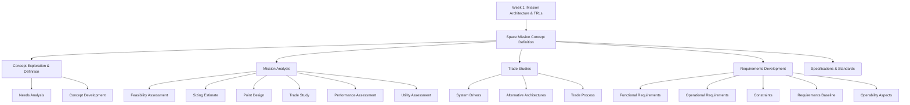

# SPCE 5045 - Space Mission Analysis: Week 2 Mastery Guide

## Overview

**Session 2: Space Mission Concept Definition** covers the systematic process of turning a broad need into a well-defined space mission. This material corresponds to Chapters 4, 5, and 6 of *Space Mission Engineering: The New SMAD* (Wertz, ISBN 978-1-881883-15-9).

Week 1 introduced the building blocks (architecture elements) and maturity framework (TRLs). This week answers the critical question: **How do you go from "we need a space system" to a concrete, requirements-driven mission design?** The answer involves concept exploration, mission analysis, trade studies, and formal requirements development.

### Topic Dependency Map

---

## Topic 1: Space Mission Concept Definition

### Analogy

Imagine you are a city planner asked to solve a transportation problem. You would not immediately start designing a bridge. Instead, you would:

1. **Understand the need:** "People need to cross the river" (needs analysis)
2. **Explore broad options:** Bridge? Tunnel? Ferry? Helicopter service? (concept exploration)
3. **Narrow to feasible options:** Eliminate helicopter service (too expensive), consider bridge vs. tunnel (concept development)
4. **Define requirements:** Must handle 10,000 cars/day, withstand earthquakes, cost under $500M (requirements definition)
5. **Trade off options:** Bridge is cheaper but tunnel avoids visual impact -- which matters more? (trade studies)
6. **Select and refine:** Choose a bridge, then specify span length, materials, lane count, etc. (detailed development)

Space mission concept definition follows this exact same process, but the "river" might be "we need to detect forest fires from orbit" and the options involve different orbits, sensors, spacecraft, and ground systems.

### Core Explanation

The mission concept definition process bridges the gap between a broad need ("detect fires") and a concrete design ("two IR satellites in polar LEO at 700 km with a dedicated ground station"). It is an **iterative, multi-stakeholder process** involving three groups:

1. **Requirements Generation (Users and Operators):** Define what the system must do, flowing from very broad needs down to specific, quantifiable requirements.

2. **Acquisition Management (Developers):** Develop alternative concepts, select the best approach, and produce a stable design.

3. **Planning, Programming, and Budgeting (Sponsors):** Establish affordability goals, set constraints, and determine firm unit costs.

These three tracks proceed in parallel, interacting through two-way feedback at every stage. The process has two major phases:

- **Concept Exploration:** Broad, open-ended. Generate potential requirements, explore alternative concepts, establish affordability goals.
- **Detailed Development:** Narrow, focused. Refine requirements into specifications, produce a stable design, establish firm costs.

The endpoint is **Production and Deployment** -- actually building and launching the system.

### Formal Definitions

| Term | Definition |
|------|-----------|
| **Mission Concept** | The overarching approach for how a mission will accomplish its objectives, including how information/services flow from the space segment to the end user. |
| **Concept Exploration** | The early phase of mission definition where broad needs are identified and alternative approaches are explored. |
| **Detailed Development** | The later phase where a selected concept is refined into a buildable design with firm requirements and costs. |
| **Needs Analysis** | The subprocess of generating potential requirements based on mission objectives, concept of operations, schedule, costs, marketplace changes, policy, threats, and technology developments. |
| **Concept Development** | The subprocess of reassessing requirements, developing alternative mission architectures, and estimating performance, cost, schedule, risk, and return on investment. |
| **Concept of Operations (ConOps)** | A description of how the system will be used from the operator's and user's perspective. |
| **Life-Cycle Cost** | The total cost of a system from initial concept through development, production, operations, and disposal. |

### Mission Timeline Elements (Table 4-8)

Every mission passes through defined phases, each driven by different factors:

| Timeline Element | Typically Driven By |
|-----------------|-------------------|
| **Planning and Development** | Funding constraints; System need date |
| **Production** | Funding constraints; Technology development; System need date |
| **Initial Launch** | Spacecraft completion; Launch availability; System need date |
| **Constellation Build-up** (if applicable) | Production schedule; Launch availability; Satellite lifetime |
| **Normal Mission Operations** | Planned operational life; Satellite lifetime (planned or failure constrained) |
| **Replenishment** | Production schedule; Failure of on-orbit satellites; Launch availability; Satellite lifetime |
| **End-of-Mission Disposal** | Legal and political constraints; Danger to other spacecraft |

### Worked Examples

#### Example 1: FireSat Concept Definition

**Broad Need:** The US Forest Service needs to detect forest fires faster than current methods (aircraft patrols, ground observers, existing weather satellites).

**Needs Analysis:**
- Mission objective: Detect fires with 0.12 K sensitivity at 300 K, 500 m resolution, 500 m location accuracy
- Coverage: 750 million acres within continental US, daily
- Responsiveness: Data to fire rangers within 30 minutes
- Schedule: Initial capability within 5 years
- Cost: < $20M/year + R&D
- Regulatory: NASA mission, responsive to public demand

**Concept Exploration:**
- Option A: Small IR satellites in LEO (low cost, high resolution, but coverage gaps)
- Option B: Single satellite in GEO (continuous coverage of CONUS, but lower resolution)
- Option C: Use existing weather satellite data (cheapest, but insufficient sensitivity/resolution)

**Concept Development:** Detailed analysis of Options A and B, estimating performance, cost, schedule, and risk for each.

#### Example 2: Commercial Communications Satellite

**Broad Need:** A telecom company wants to provide broadband internet to rural areas.

**Needs Analysis:**
- Coverage: All of North America, including remote areas
- Data rate: At least 25 Mbps per user
- Latency: Low enough for video calls (< 600 ms round trip acceptable? Or < 50 ms needed?)
- Cost: Return on investment within 10 years
- Commercial objective: Compete with terrestrial broadband

**Concept Exploration:**
- LEO constellation (low latency but many satellites, expensive)
- GEO satellite (fewer satellites, higher latency, proven technology)
- MEO constellation (compromise between LEO and GEO)

The latency requirement is a **critical driving requirement** -- it eliminates GEO if real-time applications are needed.

### Practice Questions

**Q1.** What are the three stakeholder groups in mission concept definition, and what does each contribute?

Answer

1. **Requirements Generation (Users & Operators):** Define what the system must do -- they establish performance objectives and ultimately the formal requirements.
2. **Acquisition Management (Developers):** Determine *how* to build the system -- they develop alternative concepts, select the best approach, and create a stable design.
3. **Planning, Programming, and Budgeting (Sponsors):** Determine how much can be spent -- they set affordability goals, constraints, and firm unit costs.

**Q2.** What is the difference between "Concept Exploration" and "Detailed Development"?

Answer

**Concept Exploration** is broad and open-ended: you are identifying needs, exploring many possible approaches, and establishing feasibility. Requirements are preliminary and evolving. **Detailed Development** is narrow and focused: you have selected a concept and are refining it into a buildable design with firm requirements, stable interfaces, and committed costs. The transition occurs when a concept is selected and requirements are sufficiently mature.

**Q3.** Why is the concept definition process described as "iterative"?

Answer

Because the three tracks (requirements, design concepts, and budgets) continuously influence each other. Requirements may change when developers demonstrate that a capability is infeasible at the given budget. Budgets may change when users explain that a minimum performance level is non-negotiable. Design concepts may shift when new technology becomes available or requirements change. The arrows in the process diagram point both ways between all three tracks.

### Common Pitfalls

1. **Jumping to a solution before defining the problem.** Engineers often want to start designing a spacecraft immediately. The concept definition process forces you to first understand the *need*, then explore *alternatives*, then select and refine.

2. **Treating requirements as fixed from the start.** In reality, requirements evolve as concepts are explored and costs become clearer. The process is inherently iterative.

3. **Ignoring the sponsor/budget track.** A technically elegant solution that cannot be afforded is not a solution. Cost is always a constraint.

4. **Confusing needs with requirements.** A need is a broad statement of what must be accomplished ("detect fires faster"). A requirement is a specific, quantifiable, verifiable statement ("detect temperature anomalies of 0.12 K at 300 K with 500 m spatial resolution").

### Key Takeaways

- Mission concept definition is a **structured, iterative process** involving users, developers, and sponsors.
- It proceeds from **broad needs** through **concept exploration** to **detailed development**.
- Three parallel tracks (requirements, design, budget) interact continuously.
- The process prevents premature commitment to a design before alternatives are explored.
- Every mission passes through defined **timeline phases** from planning through end-of-life disposal.

> **Active Recall:** Draw the three-track concept definition diagram from memory. Can you label the progression arrows (very broad needs -> performance objectives -> requirements; alternative concepts -> concept selection -> stable design; affordability goals -> constraints -> firm unit costs)?

---

## Topic 2: Mission Analysis

### Analogy

Mission analysis is like evaluating whether to start a business. You might:

1. **Feasibility check:** "Is it even possible to open a restaurant here?" (quick, broad)
2. **Sizing estimate:** "How big would the restaurant need to be? How many staff?" (basic numbers)
3. **Point design:** "Here's one specific restaurant layout to serve as a baseline" (concrete but not necessarily optimal)
4. **Trade study:** "Should we do Italian or Mexican? Dine-in or takeout? Downtown or suburban?" (comparing alternatives)
5. **Performance assessment:** "With this specific design, how many customers per hour can we serve?" (quantified detail)
6. **Utility assessment:** "Overall, how well does this restaurant concept meet the business objectives?" (big picture)

The first three are quick with limited detail; the last three are more detailed and used for comparing alternatives.

### Core Explanation

**Mission analysis** is the set of analytical methods used to evaluate a mission concept. The textbook identifies six types of analysis, arranged from quick/broad to detailed/focused:

#### Quick, Limited Detail:

| Analysis Type | Goal |
|--------------|------|
| **Feasibility Assessment** | To establish whether an objective is achievable and its approximate degree of complexity |
| **Sizing Estimate** | To estimate basic parameters such as size, weight, power, or cost |
| **Point Design** | To demonstrate feasibility and establish a baseline for comparison of alternatives |

#### More Detailed, Complex Trades:

| Analysis Type | Goal |
|--------------|------|
| **Trade Study** | To establish the relative advantages of alternative approaches or options |
| **Performance Assessment** | To quantify performance parameters (e.g., resolution, timeliness) for a particular approach |
| **Utility Assessment** | To quantify how well the system can meet overall mission objectives |

The progression matters: you start with quick assessments to eliminate clearly infeasible options, then invest detailed analysis only in the surviving candidates.

### Common System Drivers (Table 4-16)

A **system driver** is a parameter that has outsized influence on the overall mission design. Understanding system drivers is critical because they determine which trade-offs matter most.

| Driver | What Limits the Driver | What the Driver Limits |
|--------|----------------------|----------------------|
| **Size** | Shroud or bay size, available weight, aerodynamic drag | Payload size (frequently antenna diameter or aperture) |
| **On-orbit Weight** | Altitude, inclination, launch vehicle | Payload weight, survivability; largely determines design and manufacturing cost |
| **Power** | Size, weight (control is secondary problem) | Payload & bus design, system sensitivity, on-orbit life |
| **Data Rate** | Storage, processing, antenna sizes, limits of existing systems | Information sent to user; can push demand for onboard processing |
| **Communications** | Coverage, availability of ground stations or relay satellites | Coverage, timeliness, ability to command |
| **Pointing** | Cost, weight | Resolution, geolocation, overall system accuracy; pushes spacecraft cost |
| **Number of Spacecraft** | Cost | Coverage frequency and overlap |
| **Altitude** | Launch vehicle, performance demands, weight | Performance, survivability, coverage (instantaneous and rate), communications |
| **Coverage (geometry and timing)** | Orbit, scheduling, payload field of view & observation time | Data frequency and continuity, maneuver requirements |
| **Scheduling** | Timeline & operations, decision making, communications | Coverage, responsiveness, mission utility |
| **Operations** | Cost, crew size, communications | Frequently principal cost driver, principal error source, pushes demand for autonomy (can also save "lost" missions) |

### Worked Examples

#### Example 1: Identifying the System Driver

A mission requires 1-meter resolution imaging of ground targets from orbit. What is the primary system driver?

**Answer:** **Pointing and altitude** are the primary drivers. Resolution depends on the ratio of the sensor aperture to the altitude (for optical systems, resolution $\approx 1.22 \lambda \cdot h / D$ where $\lambda$ is wavelength, $h$ is altitude, $D$ is aperture diameter). To achieve 1-m resolution:
- At lower altitude, a smaller aperture works but you need more satellites for coverage.
- At higher altitude, a larger aperture is needed, increasing size, weight, cost, and pointing accuracy requirements.
- The pointing system must be accurate enough that the 1-m ground pixel is correctly targeted.

This is a classic example of how one requirement (resolution) cascades through multiple system drivers (altitude, size, weight, pointing, number of spacecraft, cost).

#### Example 2: Feasibility Assessment

**Question:** Can we detect individual people from geostationary orbit?

**Quick feasibility check:** GEO altitude is ~35,786 km. Detecting a person requires ~0.5 m resolution. For visible light ($\lambda \approx 0.5 \mu m$), the required aperture is:

$$D \approx 1.22 \times \lambda \times h / \text{resolution} = 1.22 \times 0.5 \times 10^{-6} \times 35,786 \times 10^{3} / 0.5 \approx 43.7 \text{ m}$$

A 44-meter aperture telescope in space is not feasible with current technology. **Conclusion: Not feasible from GEO.** This quick assessment eliminates GEO for this mission objective without detailed analysis.

### Practice Questions

**Q1.** Why do you start with feasibility assessments rather than jumping straight to trade studies?

Answer

Feasibility assessments are quick and require limited detail. They allow you to rapidly eliminate options that are clearly infeasible before investing significant time and resources in detailed trade studies. If you start with trade studies on all possible approaches, you waste effort analyzing options that a quick feasibility check would have ruled out.

**Q2.** A mission has a constraint of 300 kg total spacecraft mass. Which system drivers are most affected?

Answer

**On-orbit weight** is directly constrained at 300 kg, which limits:
- **Payload weight and size** (the primary mission instrument must fit within the mass budget)
- **Power** (less mass available for solar panels and batteries)
- **Data rate** (less mass available for larger antennas)
- **Altitude and orbit** (lighter spacecraft can reach higher orbits on smaller launch vehicles, but the 300 kg constraint also limits the choice of launch vehicles)

The mass constraint forces trade-offs across nearly every subsystem.

**Q3.** What is the difference between a "point design" and a "trade study"?

Answer

A **point design** is a single, specific design that demonstrates feasibility and serves as a baseline. It answers: "Here is one way this could work." A **trade study** compares multiple alternatives (which may include the point design) to determine which approach offers the best balance of performance, cost, risk, and schedule. The point design provides a reference; the trade study provides a decision.

### Common Pitfalls

1. **Conducting detailed analysis on infeasible options.** Always do a quick feasibility check first.
2. **Ignoring system drivers.** The drivers listed in Table 4-16 are the parameters that most strongly constrain the design. Identifying them early focuses your analysis effort.
3. **Treating system drivers as independent.** Drivers interact: increasing altitude improves communications coverage but degrades resolution. These interactions are what make trade studies necessary.

### Key Takeaways

- Mission analysis progresses from **quick/broad** (feasibility, sizing, point design) to **detailed/focused** (trade study, performance assessment, utility assessment).
- **System drivers** are the parameters that most strongly influence mission design. Identifying them early is critical.
- Drivers **interact** -- changing one affects many others, creating cascading trade-offs.

---

## Topic 3: Trade Studies

### Analogy

Buying a car involves trade-offs: fuel efficiency vs. power, size vs. maneuverability, luxury vs. price. You cannot maximize everything simultaneously. The structured process of evaluating these trade-offs -- comparing options against weighted criteria -- is exactly what a trade study does for a space mission.

### Core Explanation

A **trade study** (or trade-off analysis) is the systematic evaluation of alternative approaches to determine which best satisfies the mission objectives given constraints. Trade studies are at the heart of space mission design because no single design can optimize all parameters simultaneously.

The process involves:
1. Identifying what elements can be traded
2. Defining the options for each tradeable element
3. Constructing a trade tree of combinations
4. Pruning unrealistic combinations
5. Evaluating surviving options against criteria

### Principal Areas for Key System Trades (Table 5-2)

| Area | Principal Issue |
|------|----------------|
| **Mission Objectives** | What are we really trying to accomplish? |
| **Critical Requirements** | What requirements are hard to meet and drive cost, risk, and schedule? |
| **Mission Concept** | How do we get the information/data and deliver results to the end user? |
| **Subject** | What do we want to look at or measure? |
| **Type and Complexity of Payloads** | What spectral band? How do we measure it? How many payloads? |
| **Orbit** | A specialized orbit or one of a continuum? |
| **Number of Spacecraft** | A single satellite or a constellation? |

### Alternative Architecture Derivation

The textbook defines a 5-step process for generating alternative architectures:

| Step | Action |
|------|--------|
| **A** | Identify the mission elements subject to trade |
| **B** | Identify the main options for each tradeable element |
| **C** | Construct a trade tree of available options |
| **D** | Prune the trade tree by eliminating unrealistic combinations |
| **E** | Look for other alternatives which could substantially influence how we do the mission |

### Trade-off Possibilities

Not every element of the mission architecture can (or should) be traded. Here is an example from the FireSat mission:

| Element of Mission Architecture | Can be Traded | Reason |
|-------------------------------|--------------|--------|
| **Mission Concept** | Yes | Want to remain open to alternative approaches |
| **Subject** | No | Passive subject is well defined (heat from fires) |
| **Payload** | Yes | Can select complexity and frequencies |
| **Spacecraft Bus** | Yes | Multiple options based on scan mechanism and power |
| **Launch System** | Cost only | Choose minimum cost for selected orbit |
| **Orbit** | Yes | Options are low, medium, or high altitude with varying number of satellites |
| **Ground System** | Yes | Could share NOAA control facility, use dedicated FireSat facility, or direct downlink to users |
| **Communications Architecture** | No | Fixed by mission operations and ground system |
| **Mission Operations** | Yes | Can adjust level of automation |

### System Trade Process for Parameters with Multiple Effects (Table 5-4)

When a single parameter affects many aspects of the design, a structured 5-step trade process is used:

| Step | Description | FireSat II Example |
|------|------------|-------------------|
| **1. Select trade parameter** (typically a system driver) | Choose the parameter to trade | Altitude |
| **2. Identify factors which affect the parameter or are affected by it** | List all coupled factors | Coverage, deployment strategy, orbit period, time in view, eclipse fraction, response time, number of spacecraft, launch capability, resolution, radiation environment, communications, lifetime |
| **3. Assess impact of each factor** | Determine how each factor constrains or influences the trade | Can launch up to 1,800 km; best coverage above 600 km; resolution -- lower is better; survivability -- higher is better (but not much) |
| **4. Document and summarize results** | Create summary charts/tables | Charts of launch capability vs. altitude, coverage vs. altitude, resolution vs. altitude, survivability vs. altitude |
| **5. Select parameter value and possible range** | Choose the value and acceptable range | Altitude = 700 km; Range = 600 to 800 km |

### FireSat Trade Study Example (Table 5-3)

The textbook presents two FireSat design options to illustrate trade-offs:

| Element | Option 1 (Small LEO) | Option 6 (Large GEO) |
|---------|---------------------|---------------------|
| **Mission Concept** | IR detection of fires, results mapped and transmitted | IR detection of fires, results mapped and transmitted |
| **Subject** | Characteristics defined by specification | Characteristics defined by specification |
| **Payload** | Small-aperture IR | Large-aperture IR |
| **Spacecraft Bus** | Small, 3-axis | Mid-size, 3-axis |
| **Launch System** | Pegasus | STS, integral propulsion |
| **Orbit** | Low-Earth, 2 satellites, 2 perpendicular polar planes | Geosynchronous, 1 satellite centered over west coast of US |
| **Ground System** | Single, dedicated ground station | Single, dedicated ground station |
| **Communications Architecture** | TDRS data downlink, commercial links to users | Direct to station; results relayed to users via FireSat |
| **Mission Operations** | Continuous during fire season, partial otherwise | Continuous during fire season, partial otherwise |

**Key trade-off:** Option 1 uses small, cheap satellites close to Earth (better resolution, lower cost per satellite, but needs 2 satellites and has coverage gaps). Option 6 uses one large, expensive satellite far from Earth (continuous coverage of CONUS, but needs a much larger aperture for equivalent resolution and a much larger launch vehicle).

### FireSat II and SCS Baseline (Table 5-12)

The textbook also compares two complete mission baselines: **FireSat II** (fire detection) and **SCS** (Satellite Communications System):

| Element | FireSat II Baseline | SCS Baseline |
|---------|-------------------|-------------|
| **Subject** | Heat from fire | Handheld receiver |
| **Payload** | IR sensor | Software defined radio; bands TBD |
| **Spacecraft Bus** | SmallSat bus, body-mounted arrays, integral propulsion, Earth pointing | 200 kg SmallSat bus with deployable arrays and fixed crosslinks fore and aft |
| **Ground Segment** | Dedicated ground station in CONUS | 2 dedicated ground stations for redundancy |
| **Mission Operations** | Single facility doing fire detection and commanding | Single facility doing payload and constellation control |
| **C3 Architecture** | Direct link from ground segment to FireSat II | Continuous link from ground station in CONUS to all satellites |
| **Orbit** | 2 satellites in LEO at inclination = 60 deg | 3 satellites in circular, equatorial orbits at 20,000 km; supplemented with 3 more equatorial or 3 polar |
| **Launch Segment** | Pegasus or Minotaur I | All 3 satellites launched on a single EELV |
| **Mission Concept** | Fire detection by trained analysts at mission ops facility; fire data relayed back through FireSat II and down to end user | Fixed crosslinks provide continuous connectivity to CONUS with only 1 hop from anywhere within 50 deg of the equator |

### Worked Examples

#### Example 1: Altitude Trade for an Earth Observation Mission

You are designing an Earth observation satellite. Your key requirement is 5-meter ground resolution. Trade the altitude parameter:

**Step 1:** Trade parameter = Altitude

**Step 2:** Factors affected:
- Resolution (lower altitude = better resolution for a given aperture)
- Coverage area per pass (higher altitude = wider swath)
- Orbital period (higher altitude = longer period = fewer passes per day)
- Atmospheric drag (lower altitude = more drag = shorter orbit life or more fuel)
- Launch vehicle requirements (higher altitude = more energy needed)
- Radiation environment (varies with altitude -- Van Allen belts peak around 1,500-5,000 km)
- Communications (higher altitude = longer range = weaker signal)

**Step 3:** Assess impacts:
- At 300 km: Excellent resolution, but severe drag, short lifetime, limited coverage per pass
- At 700 km: Good resolution, manageable drag, good coverage, standard launch vehicles
- At 1,200 km: Marginal resolution (may need larger aperture), minimal drag, wide coverage, but entering inner radiation belt

**Step 4:** Document -- create charts of resolution, drag, coverage, and radiation vs. altitude

**Step 5:** Select altitude = 500-700 km range as the best compromise

#### Example 2: Single Satellite vs. Constellation

A maritime surveillance mission needs to detect ships in the North Atlantic.

**Option A: Single satellite in sun-synchronous orbit (~800 km)**
- Pro: Low cost, simple operations
- Con: Revisit time of ~12 hours (many ships missed between passes)

**Option B: Constellation of 6 satellites in 3 orbital planes**
- Pro: Revisit time of ~2 hours (much better coverage)
- Con: 6x satellite cost, more complex operations, 6x launch cost (unless ride-share)

**Trade criterion:** If the mission requires detection within 4 hours, Option A fails and Option B is required. If 12-hour revisit is acceptable, Option A is far more cost-effective.

This illustrates how a single requirement (revisit time) can determine the entire architecture.

### Practice Questions

**Q1.** Why is it important to "prune the trade tree" (Step D in Alternative Architecture Derivation)?

Answer

A full trade tree combining all options for all elements produces a combinatorial explosion of possibilities. Most combinations are unrealistic or infeasible (e.g., a 10-ton payload on a Pegasus launch vehicle, which can only lift ~450 kg to LEO). Pruning eliminates these impossible or clearly inferior combinations early, focusing analysis effort on realistic candidates.

**Q2.** In the FireSat altitude trade (Table 5-4), the selected altitude is 700 km with a range of 600-800 km. Why specify a range instead of a single value?

Answer

The range communicates flexibility for subsequent design iterations. As the design matures and more detailed analysis is performed, the optimal altitude may shift within this range. Specifying a range also alerts other subsystem designers that the altitude is not yet locked -- they should ensure their designs work across the full range. If a single value were specified prematurely, it might force unnecessary redesigns later.

**Q3.** For the FireSat trade, the "Subject" element cannot be traded. Why not?

Answer

The subject (heat from forest fires) is defined by the mission objective itself. You cannot trade it because it *is* the problem you are solving. Changing the subject would mean you are solving a different problem entirely. (However, you *can* trade how you observe the subject -- visible light vs. IR vs. radar -- which falls under the Payload element.)

**Q4.** When trading altitude for FireSat, which factor ultimately constrained the lower bound of the range (600 km)?

Answer

**Coverage.** The best coverage (in terms of area covered per unit time) occurs above 600 km. Below 600 km, the swath width is too narrow and more satellites would be needed to achieve adequate coverage, increasing cost. Atmospheric drag also becomes a significant factor below ~500 km, reducing satellite lifetime.

### Common Pitfalls

1. **Not identifying all affected factors in a trade.** If you trade altitude and forget to consider radiation environment, you might select an altitude in the heart of the Van Allen belts.

2. **Trading too many parameters simultaneously.** Trade one parameter at a time (or a small coupled set), keeping others at their baseline values. This isolates the effects and makes the trade understandable.

3. **Treating all trade criteria as equally important.** Some criteria are "must haves" (hard constraints) and others are "nice to haves" (soft preferences). A weighted evaluation matrix should reflect these differences.

4. **Stopping at the first feasible design.** The point of trade studies is to find the *best* design among alternatives, not just any design that works.

### Key Takeaways

- Trade studies are the **core analytical method** for selecting among alternative mission designs.
- The process is structured: identify tradeable elements, generate options, build a trade tree, prune, evaluate.
- **System drivers** (altitude, mass, power, etc.) have cascading effects across multiple subsystems.
- The **altitude trade** is a canonical example: it affects resolution, coverage, drag, radiation, launch, and communications simultaneously.
- Trades should specify a **value and range**, not just a single number.
- Some architecture elements are **fixed** (subject, sometimes communications architecture) while others are **tradeable**.

> **Active Recall:** From memory, list the 5 steps of Alternative Architecture Derivation. Then list at least 6 factors affected by a change in orbital altitude.

---

## Topic 4: Requirements Development

### Analogy

Think of building a house. The requirements are not "build a nice house." They are specific, measurable statements:

- **Functional:** "The house shall have 4 bedrooms, each at least 120 sq ft" (what it must do)
- **Operational:** "The house shall be suitable for a family of 5, with a 2-car garage accessible from the main road" (how it will be used)
- **Constraints:** "The house shall be built on the existing lot (50 x 100 ft), comply with city zoning code, and cost no more than $400,000" (limitations imposed on the design)

Each requirement must be **verifiable** -- you can inspect, test, or analyze whether it is met. "Build a nice house" is not verifiable. "Each bedroom shall be at least 120 sq ft" is verifiable by measurement.

### Core Explanation

Requirements are the bridge between **what users need** and **what engineers build**. Poor requirements are the single most common cause of space mission failures and cost overruns. The textbook (Table 6-1) identifies critical features of good requirements and a structured process for developing them.

#### Critical Features of Requirements

- Should be based on **fundamental mission objectives** (mission or payload derived)
- Should **flow down** from basic (high-level) requirements to detailed (subsystem-level) requirements
- Should be part of the **system trade process** (not developed in isolation)
- Should state **what is to be done** (pointing, mapping, timing), **not how to do it** (specific orbit, specific attitude, specific clock)
- Should be **quantitative expressions** of how well objectives are met
- Must be recorded in the **system specification**

#### Types of Requirements

| Type | Definition | Example (FireSat II) |
|------|-----------|---------------------|
| **Functional Requirements** | How well the system must perform | 0.12 K sensitivity at 300 K; 500 m resolution; 500 m location accuracy |
| **Operational Requirements** | How the system is to be used | Mission operational at least 10 yrs; 98% availability excluding weather; data to 500 fire-monitoring offices + 2,000 rangers |
| **Constraints** | Limitations imposed on the system | Cost < $20M/yr + R&D; initial capability within 5 yrs; NASA mission; natural environment only (not designed for nuclear war survivability) |

#### Elements to Document for Each Requirement

| Element | Meaning |
|---------|---------|
| **Function** | What is to be done |
| **Performance Requirement** | How well it has to be done |
| **Verification** | How the performance is to be verified (by inspection, test, or analysis) |
| **Reason** | *Why* it is required (typically omitted from specifications, but critical for understanding intent) |

The "reason" element is particularly important because it enables engineers to propose alternative solutions. If you know *why* a requirement exists, you can sometimes find a better way to satisfy the underlying need.

### Requirements Baseline Process (11 Steps)

The textbook presents an 11-step process for establishing a requirements baseline:

1. **Identify the customer and user** of the product or services. A customer may be a procuring agent but not the ultimate user; both must be understood.
2. **Identify and prioritize** customer/user objectives and needs for the mission.
3. **Define internal and external constraints.**
4. **Translate customer/user needs** into functional attributes and system characteristics. Quality Function Deployment (QFD) is one tool for this.
5. **Establish functional requirements** for the system and provide for decomposition to elements.
6. **Establish functional flow** and representative performance of functions.
7. **Translate functional attributes** into technical characteristics which become requirements for the physical system.
8. **Establish quantifiable requirements** from all the above steps.
9. **Use block diagrams** to express interfaces and hardware/software/data relationships at the system level.
10. **Decompose** functional requirements and characteristics to successive lower levels (subsystem, component), defining the basis of the system elements.
11. **Iterate** at all steps with preceding activities to test assumptions and reconcile higher-level requirements with functional implementation.

### Top-Level Mission Requirements Example (Table 6-2)

| Requirement Category | Factors | FireSat II Example |
|---------------------|---------|-------------------|
| **FUNCTIONAL** | | |
| Performance | Primary objective, payload size, orbit, pointing | 0.12 K sensitivity at 300 K; 500 m resolution; 500 m location accuracy |
| Coverage | Orbit, swath width, number of satellites, scheduling | Daily coverage of 750 million acres within continental US |
| Responsiveness | Communications architecture, processing, delays, operations | Send registered mission data within 30 min to up to 50 users |
| Secondary Mission | As above | Land and sea surface temperature, high-res water vapor imagery and crude winds over continental US |
| **OPERATIONAL** | | |
| Duration | Experiment or operations, level of redundancy, altitude | Mission operational at least 10 years |
| Availability | Level of redundancy | 98% excluding weather, 3-day maximum outage |
| Survivability | Orbit, hardening, electronics | Natural environment only |
| Data Distribution | Communications architecture | Up to 500 fire-monitoring offices + 2,000 rangers worldwide (max. 100 simultaneous users) |
| Data Content, Form, Format | User needs, level and place of processing, payload | Location and extent of fire on any of 12 map bases, average temperature for each 30 m$^2$ grid |
| **CONSTRAINTS** | | |
| Cost | Manned flight, number of spacecraft, size, complexity, orbit | < $20M/yr + R&D |
| Schedule | Technical readiness, program size | Initial operating capability within 5 yrs, final capability within 6 yrs |
| Regulations | Law and policy | NASA mission |
| Political | Sponsor, whether international program | Responsive to public demand for action |
| Environment | Orbit, lifetime | Natural |
| Interfaces | Level of user and operator infrastructure | Comm. relay and interoperable through NOAA ground stations |
| Development Constraints | Sponsoring organization | No unique operations people at data distribution nodes |

### Requirements Activities Across Program Phases

Requirements activities evolve as the program matures:

**Phase 1: Needs Analysis**
- Defining mission requirements
- Defining environment
- Identifying mission drivers and constraints
- Technology programs

**Phase 2: Concept Development**
- Identifying critical driving requirements and associated risks
- Developing operations and design concepts
- Cost estimates
- Functional analysis and major interfaces
- System studies and simulations
- Prototyping and assessing technology

**Phase 3: Concept Validation**
- Tailored system and segment definitions
- Preliminary internal interface requirements
- Preliminary system standards
- Preliminary requirements flowdown
- Integrated system validation including test planning
- Transition planning
- Validating technology

**Phase 4: Design and Implementation**
- Detailed requirements flowdown
- Developing formal design documentation and interface control
- Integrating and testing the system
- Demonstrating and verifying the system
- Test procedures and reports

### Aspects of "Operability"

The textbook defines 9 aspects of system operability -- how easy the system is to operate:

| Aspect | Definition |
|--------|-----------|
| **1. Visibility/Observability** | The extent to which the system provides the operations team with usable information about the configuration, status, and performance of the system. |
| **2. Commandability/Controllability** | The extent to which the operations team can place the flight system in the desired state and produce the desired outcome via commanding. |
| **3. Predictability** | The extent to which the operations team is able to predict, with some certainty, the outcome of the execution of a planned event. |
| **4. Flexibility** | The extent to which the operations team can reconfigure components to maximize utilization, circumvent anomalous components, provide options, and increase robustness. |
| **5. Robustness** | The extent to which the system maintains performance under perturbations and prevents and contains errors. |
| **6. Autonomy** | The extent to which the system manages nominal or contingency operations without ground intervention. |
| **7. Efficiency** | The extent to which the operations team can optimize the use of time and resources. |
| **8. Testability** | The extent to which the operations team can verify and validate system components and test assets. |
| **9. Tractability** | The extent to which the operations team is freed from the need to pay attention to, or "care and feed" the system. |

These 9 aspects are important because **operations is frequently the principal cost driver** for a space mission. A system that is difficult to operate (low operability) costs more over its lifetime, even if the hardware is cheap.

### Worked Examples

#### Example 1: Writing Good vs. Bad Requirements

**Bad requirement:** "The satellite shall have a good camera."
- Not quantifiable, not verifiable, states "how" rather than "what"

**Good requirement:** "The payload shall detect temperature anomalies of 0.12 K or greater at a scene temperature of 300 K, with a spatial resolution of 500 m or better and a geolocation accuracy of 500 m or better."
- Quantifiable (0.12 K, 500 m, 500 m)
- Verifiable (can be tested against known thermal sources)
- States what is to be done, not how

#### Example 2: Requirement Flowdown

**Top-level requirement:** "The system shall provide daily coverage of 750 million acres within the continental US."

**Flowdown to subsystem requirements:**
- **Orbit:** Must provide sufficient ground track spacing for daily revisit over CONUS. For a satellite at 700 km altitude with a swath width of X km, the orbit must be near-polar with specific inclination.
- **Payload:** Must have a field of view wide enough to achieve the required swath width.
- **Number of spacecraft:** If one satellite cannot cover 750M acres/day, a constellation is needed.
- **Mission operations:** Must schedule observations to maximize coverage within CONUS.

#### Example 3: Identifying Requirement Types

Classify each statement:

a) "The system shall transmit fire detection data within 30 minutes of acquisition."
b) "The system shall operate for at least 10 years."
c) "The system cost shall not exceed $20M per year plus R&D."
d) "The payload shall achieve 500 m spatial resolution."

Answers

a) **Functional** (performance of the data delivery function) -- could also be argued as **operational** depending on context
b) **Operational** (how long the system is to be used)
c) **Constraint** (limitation imposed on the system)
d) **Functional** (how well the observation function must perform)

### Practice Questions

**Q1.** Why should requirements state "what is to be done" rather than "how to do it"?

Answer

Stating "what" preserves design freedom. If you specify "the satellite shall be in a 700 km sun-synchronous orbit," you have eliminated all other orbits that might also meet the actual need (e.g., daily coverage of CONUS). If instead you specify "the system shall provide daily coverage of 750 million acres within CONUS," the designers can explore multiple orbit options (different altitudes, inclinations, constellation sizes) that all satisfy the requirement. "What" requirements enable trade studies; "how" requirements prevent them.

**Q2.** What is the purpose of documenting the "reason" for each requirement?

Answer

The "reason" captures *why* a requirement exists -- the underlying need or objective it supports. This enables:
1. Engineers to propose alternative solutions that better satisfy the underlying need.
2. Trade studies that might relax a requirement if the cost of meeting it is disproportionate to its importance.
3. Future engineers to understand the intent, even if the original authors are no longer available.
4. Detection of "orphan" requirements that no longer serve a valid need.

**Q3.** List the three methods of verification and give an example of each.

Answer

1. **Inspection:** Visual or physical examination. *Example:* Verify that the satellite has a specified connector type by looking at it.
2. **Test:** Subjecting the system to controlled conditions and measuring results. *Example:* Place the IR sensor in front of a blackbody source at 300 K and measure whether it detects a 0.12 K anomaly.
3. **Analysis:** Mathematical or computational evaluation. *Example:* Use orbit propagation software to verify that the selected orbit provides daily coverage of 750 million acres in CONUS.

**Q4.** Why is "autonomy" listed as an aspect of operability?

Answer

A more autonomous system requires less ground intervention for routine operations and can handle contingencies independently. This reduces operations cost (fewer staff needed, less communication bandwidth required) and improves responsiveness (the spacecraft can react to anomalies faster than waiting for a ground command). Since operations is often the principal cost driver over the mission lifetime, designing for appropriate autonomy directly reduces life-cycle cost.

### Common Pitfalls

1. **Gold-plating requirements.** Adding unnecessarily stringent requirements drives up cost and risk. Every requirement should be traceable to a mission objective with a documented reason.

2. **Specifying "how" instead of "what."** This is the most common requirements error. It eliminates design options and prevents trade studies.

3. **Forgetting verification.** A requirement that cannot be verified (by inspection, test, or analysis) is not a useful requirement. If you cannot prove it is met, it should not be in the specification.

4. **Treating requirements as write-once.** Requirements evolve through the iterative concept definition process. They should be regularly reviewed and updated as the design matures.

5. **Ignoring operability.** A system that works perfectly but is impossible to operate is a failure. The 9 aspects of operability should be considered as requirements from the start.

### Key Takeaways

- Requirements bridge the gap between **user needs** and **engineering design**.
- Three types: **functional** (how well), **operational** (how used), **constraints** (limitations).
- Each requirement needs: **function**, **performance**, **verification method**, and ideally **reason**.
- Requirements should state **what**, not **how**, to preserve design freedom.
- The 11-step baseline process is **iterative** -- assumptions are tested and reconciled at every level.
- **Operability** (9 aspects) is critical because operations is often the largest cost driver over the mission lifetime.
- Verification is by **inspection, test, or analysis**.

> **Active Recall:** Can you list the three types of requirements and give an example of each? Can you name at least 5 of the 9 aspects of operability from memory?

---

## Topic 5: Specifications and Standards

### Analogy

Think of building codes for houses. The **specification** for your house describes the specific requirements for *your* house (square footage, number of rooms, materials). The **standards** are the industry-wide codes that all houses must follow (electrical codes, plumbing codes, fire safety codes). You write a specification for each project; you adopt existing standards that apply across all projects.

### Core Explanation

**Specifications** are formal documents that record the requirements for a specific system or subsystem. They are the contractual basis for what the developer must deliver.

**Standards** are industry-wide or government-wide documents that define best practices, processes, and minimum quality levels. They are developed by organizations like AIAA, IEEE, NASA, DoD, and others.

In space mission design, the system specification captures the requirements developed through the process described in Topic 4. Standards provide the framework within which those requirements are developed and verified.

The textbook refers to Section 6.6 (page 119) for detailed treatment of standards applicable to space missions.

### Key Standards Organizations for Space

| Organization | Types of Standards |
|-------------|-------------------|
| **AIAA** | Technical standards for aerospace design and analysis |
| **IEEE** | Electrical, electronic, and software standards |
| **NASA** | NASA-specific standards for spacecraft design, testing, and operations |
| **DoD** | Military standards (MIL-STD) for defense space systems |
| **ISO** | International standards for quality management, environmental management |
| **ECSS** | European Cooperation for Space Standardization |

### Practice Questions

**Q1.** What is the difference between a specification and a standard?

Answer

A **specification** is project-specific: it documents the requirements for a particular system ("FireSat II shall detect temperature anomalies of 0.12 K..."). A **standard** is industry-wide: it defines best practices or minimum quality levels that apply across many projects ("All spacecraft electronic components shall be tested per MIL-STD-883"). You write a specification for each mission; you reference existing standards that apply.

**Q2.** Why are standards important in space mission design?

Answer

Standards ensure:
1. **Consistency** across programs and organizations
2. **Minimum quality** -- critical in space where repair is impossible
3. **Interoperability** between systems from different developers
4. **Knowledge transfer** -- lessons learned from past missions are encoded in standards
5. **Contractual clarity** -- standards provide agreed-upon definitions and processes

### Common Pitfalls

1. **Blindly applying all standards.** Not every standard applies to every mission. Standards should be "tailored" to the specific program -- applying only relevant requirements.
2. **Ignoring standards entirely.** Standards encode decades of lessons learned. Ignoring them risks repeating past failures.

### Key Takeaways

- **Specifications** are project-specific documents recording mission requirements.
- **Standards** are industry-wide documents defining best practices and minimum quality levels.
- Standards should be **tailored** to each mission -- apply what is relevant, exclude what is not.
- Key standards organizations: AIAA, IEEE, NASA, DoD, ISO, ECSS.

---

## Integrative Summary

Week 2 takes the architecture framework from Week 1 and shows you how to **define, analyze, trade, and formalize** a space mission:

1. **Concept Definition** is a structured, iterative process involving users, developers, and sponsors moving from broad needs to specific designs.

2. **Mission Analysis** provides a toolkit of progressively detailed analytical methods -- start with quick feasibility checks, end with comprehensive utility assessments.

3. **Trade Studies** are the mechanism for choosing among alternatives. They are structured (5-step architecture derivation) and systematic (system trade process for parameters with multiple effects).

4. **Requirements** are the formal bridge between needs and design. They must be quantifiable, verifiable, and should state "what" not "how." Three types: functional, operational, constraints.

5. **Specifications and Standards** formalize requirements into contractual documents and ensure consistency with industry best practices.

The connecting thread: **every decision flows from the mission objectives, through the requirements, into the design via trade studies.** If you cannot trace a design choice back to a requirement, and that requirement back to a mission objective, something has gone wrong.

> **Spaced Review Prompt:** After 48 hours, try to:
> 1. List the 6 types of mission analysis from memory
> 2. Reproduce the 5-step Alternative Architecture Derivation process
> 3. Name the 3 types of requirements with examples
> 4. List the 11 steps of the requirements baseline process (at least 6 from memory)
> 5. Name at least 5 of the 9 aspects of operability

---

## Glossary

| Term | Definition |
|------|-----------|
| **Alternative Architecture** | A different combination of mission element options that could accomplish the mission objectives. |
| **C3** | Command, Control, and Communications architecture. |
| **Concept Development** | The subprocess of developing and assessing alternative mission architectures. |
| **Concept Exploration** | The early phase of mission definition where broad needs are identified and alternatives explored. |
| **ConOps** | Concept of Operations. A description of how the system will be used from the operator's and user's perspective. |
| **Constraint** | A limitation imposed on the system (cost, schedule, regulatory, environmental, etc.). |
| **CONUS** | Continental United States. |
| **DT&E** | Developmental Test and Evaluation. |
| **EELV** | Evolved Expendable Launch Vehicle. A family of US launch vehicles (Atlas V, Delta IV). |
| **Feasibility Assessment** | Quick analysis to determine if an objective is achievable. |
| **FireSat** | The textbook's running example mission -- a satellite system for detecting forest fires via IR sensing. |
| **Flowdown** | The process of decomposing high-level requirements into successively more detailed subsystem and component requirements. |
| **Functional Requirement** | A requirement specifying how well the system must perform. |
| **GEO** | Geostationary Earth Orbit (~35,786 km altitude, equatorial, 24-hour period). |
| **IR** | Infrared. Electromagnetic radiation used for thermal detection. |
| **LEO** | Low Earth Orbit (~200-2,000 km altitude). |
| **Life-Cycle Cost** | Total cost from initial concept through disposal. |
| **Mission Analysis** | The set of analytical methods used to evaluate a mission concept. |
| **Mission Concept** | The overarching approach for how a mission accomplishes its objectives. |
| **Needs Analysis** | The subprocess of generating potential requirements from mission objectives and constraints. |
| **NOAA** | National Oceanic and Atmospheric Administration. US government agency operating weather satellites. |
| **Operability** | The ease with which a system can be operated, encompassing 9 defined aspects. |
| **Operational Requirement** | A requirement specifying how the system is to be used. |
| **OT&E** | Operational Test and Evaluation. |
| **Performance Assessment** | Detailed analysis quantifying performance parameters for a particular approach. |
| **Point Design** | A single specific design demonstrating feasibility and providing a baseline for comparison. |
| **QFD** | Quality Function Deployment. A tool for translating customer needs into engineering requirements. |
| **SCS** | Satellite Communications System. A second example mission in the textbook. |
| **Sizing Estimate** | Quick estimate of basic parameters (size, weight, power, cost). |
| **Specification** | A formal document recording the requirements for a specific system. |
| **Standard** | An industry-wide document defining best practices and minimum quality levels. |
| **Subject** | The thing being observed, communicated with, or acted upon by the space mission. |
| **System Driver** | A parameter that has outsized influence on the overall mission design. |
| **TDRS** | Tracking and Data Relay Satellite. NASA's constellation for communicating with LEO spacecraft. |
| **Trade Study** | Systematic evaluation of alternative approaches to determine which best satisfies mission objectives. |
| **Trade Tree** | A combinatorial diagram of all possible combinations of tradeable mission elements. |
| **TRL** | Technology Readiness Level. A 1-9 scale measuring technology maturity. |
| **Utility Assessment** | Analysis quantifying how well the system meets overall mission objectives. |
| **Verification** | The process of confirming that a requirement is met, via inspection, test, or analysis. |

---

## References

1. Wertz, J.R., Everett, D.F., and Puschell, J.J., *Space Mission Engineering: The New SMAD*, Microcosm Press, 2011. ISBN 978-1-881883-15-9. (Chapters 4, 5, 6)
2. Chapter 4: "Requirements Definition" -- Mission concept definition, timeline, and concept exploration
3. Chapter 5: "Space Mission Concept Development" -- Trade studies, alternative architectures, system trades
4. Chapter 6: "Requirements and Specifications" -- Requirements development, critical issues, operability, standards
5. Department of Defense, *Systems Engineering Fundamentals*, Defense Acquisition University, 2001.
6. INCOSE, *Systems Engineering Handbook*, 4th Edition, Wiley, 2015.
7. NASA, *NASA Systems Engineering Handbook* (SP-2016-6105 Rev2), 2016.
